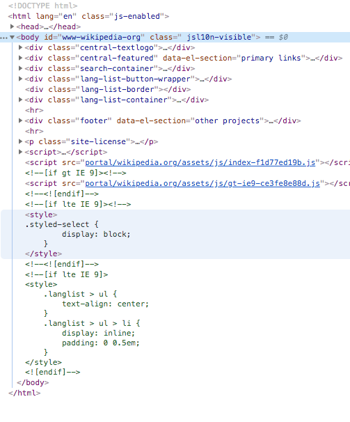
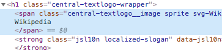
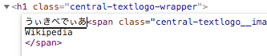
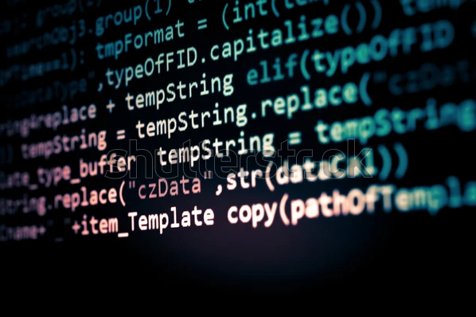
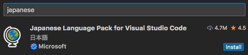
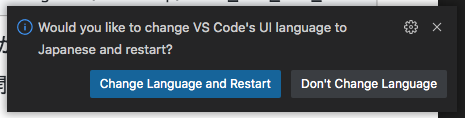

<!-- _class: cover -->

<h1 class="logo"><b>CODE</b>_THE_WEB</h1>
<p class="title">コードでウェブをつくろう</p>
<p class="author">&copy; 2024 Satoshi Soma</p>

---

## ウェブサイトは「何」でできている？
- [YouTube](https://www.youtube.com/): 動画
- [Instagram](https://www.instagram.com/themuseumofmodernart/): 画像
- [SoundCloud](https://soundcloud.com/stillwoozy): サウンド
- [Wikipedia](https://www.wikipedia.org/): 文章と画像
- [X (Twitter)](https://twitter.com/daftpunk_music): 文章, 画像, 動画

---

## 画像 “だけ” を並べてみた。
[01/example/songs.html](example/songs.html)<small>（ `⌘` を押しながらクリックすると別タブで開きます。）</small>

---

## 足りないもの
- インタラクション（入力に対する反応）
- ページ間のつながり（リンク）
- デザイン（レイアウトや色、フォントなど）

---

動画, 画像, 音楽, 文章といった素材は
ウェブサイトを構成する *部品（パーツ）* にすぎない。

部品をただ並べるだけではウェブサイトはつくれない。
それらを**まとめ上げ、一つのサイトとして組み立てる仕組み**が必要。

---

## サイトのナカミをみてみよう
1. [適当なサイト](https://www.wikipedia.org/)をブラウザで開く (Wixで作ったサイトでもOK)
2. 「*開発者ツール*」を開く `alt + ⌘ + I`

---

このカラフルな呪文のようなテキストは
## “HTML コード” という。

*HTML* とは
>*H*yper ハイパー
*T*ext テキスト
*M*arkup マークアップ
*L*anguage 言語

の略。

今、あなたが開いているサイトは
**この HTML コードによってできている**。



---

## HTML コードを勝手に書き換えてみよう
1. [Wikipedia.org](https://www.wikipedia.org/) のトップページにあるロゴを右クリック
2. 「*要素を検証*」（または「*Inspect*」）
3. *青くハイライトされた部分*を右クリック
	
4. 「*Edit as HTML*」
5. 出てきた枠の中に、適当に文字を打ち込む
	
6. `⌘ + Enter` で反映させる

---

## <small>（ほぼ）</small>全てのウェブサイトは HTML コードでできている
- Wix でつくったサイト
- [YouTube](https://www.youtube.com)
- [Apple](https://www.apple.com) のサイト
- [Google](https://www.google.com/search?q=webdesign) の検索一覧
- [Twitter](https://twitter.com/home) や [Instagram](https://www.instagram.com/) などの SNS
- [阿部寛のホームページ](http://abehiroshi.la.coocan.jp/)
- etc.

---

## “コード” とは
**一定のルール（規則）** に従って記述された
*テキスト（文字情報）*。

そして *HTML コード*とは、
**HTML という言語のルールに従って記述された文字情報**。



---

## HTML を書くには
HTML コードはテキストデータなので、書くために特別なツールなどは必要ない。
必要なのは*テキストエディタ*のみ。

- TextEdit（macOS に付属）
- メモ帳（Windows に付属）
- etc.

---

## でも、どうせなら適したエディタを
OS に付属しているテキストエディタでも HTML コードを書くことはできるが、
それらは汎用的なテキスト編集（レシピのメモや作文, 文書作成など）を目的としたエディタで、*コーディング\*という専門性の高い用途に利用するには機能が少なく、
適しているとは言い難い*。

<small style="display:block;text-align:right">（* コードを書くことを「コーディング」という。）</small>

よって、**コード編集のために最適化されたエディタ（コードエディタ）**
を利用することが強く推奨される。

---

コードエディタには無料・有料含め様々なものが存在するが、
当講義では、*[VisualStudio Code (VS Code)](https://code.visualstudio.com/)* を使用する。

VS Code はマイクロソフトが開発しているコードエディタで、
誰でも無料で使用することができる。VS Code を選ぶ理由は、
- 高機能（コード編集に欲しい機能は一通り揃っている）
- 比較的新しい（開発が盛ん）
- Mac にも Windows にも対応している
- ウェブ界隈ではほぼ**デファクトスタンダード（事実上の標準）**（2024 年現在）
  - <small>プロ, アマチュア問わず幅広いユーザー層。<br>使い方を身につけておけば今後も役に立ちそう</small>

---

## サイト制作環境を整えよう

---

### VS Code を日本語化する
VS Code の初期設定は英語なので、*日本語化プラグイン*をインストールしよう。

1. VS Code を開く
2. ウィンドウ左端にある「*Extensions*  」アイコンをクリック
3. 「*Search Extensions*」に `japanese` と入力する
4. 「*Japanese Language Pack*」を「*Install*」

5. 画面右下にポップアップ表示される「*Change Language and Restart*」をクリック


---

### 作業環境を構築する

1. *Terminal（ターミナル）* を開く
2. 以下のコマンドを*コピー*し、Terminal に*ペースト*。その後 `Enter` でコマンド実行
```sh
git clone https://github.com/amekusa/code_the_web.git ~/Desktop/code_the_web_2024
```
3. *デスクトップ*に *`code_the_web_2024`* フォルダができているか確認
4. *VS Code* で `code_the_web_2024` フォルダを開く
`ファイル` → `フォルダーを開く` → `デスクトップ` → `code_the_web_2024`

`code_the_web_2024` フォルダには今見ているスライドも含まれているので、いつでも好きな時に参照してください。場所: `01/README.html`

---

## .html ファイルを編集してみよう
HTML コードを記述するファイルには*拡張子 `.html`* を付ける。
サンプルの HTML ファイルを複製し、コードに手を加えてみよう。

---

1. *`00_base.html`* を *`WORKSPACE`* フォルダに*コピー*。

`WORKSPACE` フォルダはあなたが**自由に使える作業用スペース**です。
*今後、各自のコーディング作業は `WORKSPACE` フォルダ内で行ってください*。

VS Code 上でファイルをコピーするには、
- `alt` を押しながらドラッグ & ドロップ
- ファイルを選択し `⌘ + C` 、コピー先のフォルダを選択し `⌘ + V`

いずれかの方法で可。

---

2. `WORKSPACE/00_base.html` を *`index.html`* にリネーム（名前変更）する。

ファイルのリネームは、
- ファイルを選択し `Enter`
- ファイルを右クリックし「名前の変更」

いずれかの方法で可。

---

3. `WORKSPACE/index.html` を*ブラウザで開く*

`WORKSPACE/index.html` を右クリック → 「*Finder で表示*」
→ Finder 上でダブルクリック、またはブラウザにドラッグ & ドロップ

3. VS Code で `WORKSPACE/index.html` を開き、
`Hello World! こんにちは！` の部分を適当に編集
4. ブラウザを更新し、表示の変化を確認する
5. 開発者ツール `alt + ⌘ + I` でも確認する

---

## HTML 言語の文法
どんな言語にも一定の規則、つまり*文法*が存在する。
*HTML という言語* もその例外ではない。

---
HTML の文法は “**タグ (Tag)**” を最小単位として成り立っている。

- `<html>`
- `<head>`
- `<body>`
- `<h1>`
- `<p>`
- etc.

タグは、その役割に応じて多くの種類が存在するが、
**どれも必ず `<` で始まり `>` で終わる**。

`<` と `>` で挟まれている部分は*タグの名前*で、
*名前によってタグの役割が異なる*。

---

一部の例外を除いて、ほとんどのタグは*それ単体では意味を成さない。*
タグは**テキストを「囲む」ことでそのテキストに特定の役割や機能を与える。**

```html
<h1>こんにちは</h1>
```

これは `こんにちは` というテキストを `<h1>` タグで囲んだ例である。

`</h1>` は「*閉じタグ*」といって、*`<h1>` と必ずセットで記述する必要がある*。

「**開いたタグは、どこかで閉じなくてはならない**」という、
HTML 文法上の原則があるからだ。<small>それにも例外は存在するが...。</small>

---

## `<h1>` タグ
`<h1>` タグは "**見出し**" を意味するタグである。
（h は *Heading* からきている。）

`<h1>` と `</h1>` でテキストを囲むことで、
その部分のテキストに **"見出し" という役割を与える**ことができる。

試しに `WORKSPACE/index.html` の `Hello World！` の部分だけを
`<h1>` タグでくくってみよう。
そしてブラウザ上で表示がどう変化するかを確認してほしい。

---

## HTML の基本構造
```html
<!DOCTYPE html>
<html>
  <head>
    <!-- メタ情報 -->
  </head>
  <body>
    <!-- コンテンツ -->
  </body>
</html>
```

ウェブページは **`<html>` タグを起点（ルート）** とし、
その中に **`<head>` タグと `<body>` タグが入れ子**となった構造になっている。
`<!DOCTYPE html>` はタグではなく、*「これから HTML の記述を開始します。」
という宣言*のようなものだ。よって、一行目に記述しなければならない。

---

`<head>` タグの中には、ページの*メタ情報*を記述するのだが、その内容は**ブラウザ上には表示されない**。メタ情報については後の講義で解説するので、今は一旦忘れてほしい。

逆に、ブラウザ上に表示したい内容、すなわち*ページのコンテンツ*となる情報は、
**全て `<body>` タグの中に記述しなければならない**。

木構造で表すとこのようになる。

```
<!DOCTYPE html>
<html>
├── <head>
│   └── メタ情報（表示されない）
└── <body>
    └── コンテンツ（表示される）
```

---

## 他のタグも見てみよう
*`01_tags.html`* を `WORKSPACE` フォルダにコピーし、
ブラウザと VS Code 双方で開いてください。

---

## タグと属性
タグには必要に応じて "**属性 (Attribute)**" という*付帯情報*を持たせることができる。

書き方はこんな感じ。
```html
<タグ名 属性名="属性値">
```

属性は基本的に、*属性名*と*属性値*の 1 セットになっており、
**付帯するタグの機能を補完**する役割を持つ。

どのような属性があるのか、詳しく見ていこう。

---

*`02_attributes.html`* を `WORKSPACE` フォルダにコピーし、
ブラウザと VS Code で双方で開いてください。

---

ここまでで学んだ HTML の文法を踏まえ、
自分の好きなウェブサイトの HTML コードを分析してみよう。

1. ブラウザで好きなサイトを開く
2. 見出しやリンク、画像などを右クリックし `要素を検証` または `Inspect`
3. タグ名や属性値がどうなっているか、などを確認する
4. HTML をその場で書き換えて、表示がどのように変わるかを確認する

---

## 付録
コーディングでよく使う記号の読み方と入力方法
https://greenowl5.com/siro/tips/keyboard.html

コーディングでよく使う括弧の読み方
https://gist.github.com/fjm/0cd61f204ff0b009ea56317a57549a25

