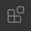

<style>
h1.logo {
  font-size: 64px;
}
.logo {
  font-family: Futura, sans-serif;
  font-weight: normal;
  letter-spacing: .1em;
}
.logo b {
  font-weight: bold;
  letter-spacing: .3em;
  text-shadow:
    0 -.3em 0 #60f4,
    0 -.75em 0 #0f66,
    0 -1.4em 0 #ff08;
}
.logo::before {
  content: "[";
  padding-right: .5em;
}
.logo::after {
  content: "]";
  padding-left: .5em;
  text-shadow:
     .6em 0 0 #f098,
    1.2em 0 0 #f206,
    1.8em 0 0 #fb06;
}
.logo::before,
.logo::after {
  font-family: Helvetica;
  font-size: .9em;
  vertical-align: .13em;
}
</style>

<h1 class="logo"><b>CODE</b>_THE_WEB</h1>
コードでウェブをつくろう

---

## ウェブサイトは「何」でできている？
- [YouTube](https://www.youtube.com/): 動画
- [Instagram](https://www.instagram.com/shibasnacks/): 写真やイラスト
- [SoundCloud](https://soundcloud.com/stillwoozy): 音楽
- [Wikipedia](https://www.wikipedia.org/): 文章と画像
- [Twitter](https://twitter.com/daftpunk_music): 文章, 画像, 動画

---

## 画像 “だけ” を並べてみた。
[01/example/songs.html](example/songs.html)<small>（ `⌘` を押しながらクリックすると別タブで開きます。）</small>

---

## 足りないもの
- インタラクション（入力に対する反応）
- ページ間のつながり（リンク）
- デザイン（レイアウトや色、フォントなど）

---

動画, 画像, 音楽, 文章といった素材は
ウェブサイトを構成する*部品*にすぎない。

部品をただ並べるだけではウェブサイトはつくれない。
それらを**サイトとして組み立てる仕組み**が必要。

---

## ナカミをみてみよう
1. [適当なサイト](https://www.wikipedia.org/)をブラウザで開く (Wixで作ったサイトでもOK)
2. 「開発者ツール」を開く `alt + ⌘ + I`

---

このカラフルな呪文は
## “HTML コード” といいます。

HTML とは

*H*yper :: ハイパー
*T*ext :: テキスト
*M*arkup :: マークアップ
*L*anguage :: 言語

の略。

今、あなたが開いているサイトは
**この HTML コードによってできている**。


---

# サイトを勝手に改変してみよう
1. [Wikipedia.org](https://www.wikipedia.org/) のトップページにあるロゴを右クリック
2. 「*要素を検証*」（または「*Inspect*」）
3. *青くハイライトされた部分*を右クリック
	
4. 「*Edit as HTML*」
5. 出てきた枠の中に、適当に文字を打ち込む
	
6. `⌘ + Enter` で反映させる

---

## （ほぼ）全てのウェブサイトは HTML コードでできている
- Wix でつくったサイト
- [YouTube](https://www.youtube.com)
- [Apple](https://www.apple.com) のサイト
- [Google](https://www.google.com) の検索一覧
- [Twitter](https://twitter.com/home) や [Instagram](https://www.instagram.com/) などの SNS
- [阿部寛のホームページ](http://abehiroshi.la.coocan.jp/)

---

## “コード” とは
**一定のルール（言語, 文法）** に従って記述された
*テキスト（文字情報）*。

つまり *HTML コード*とは、
**HTML という言語, 文法に従って記述された文字情報**。


---

## HTML を書くには
HTML コードはテキストデータなので、書くのに特別なツールは必要ない。
必要なのは*テキストエディタ*のみ。

- TextEdit (macOS)
- メモ帳 (Windows)

---

## でもどうせなら適したエディタを
OS に付属しているテキストエディタでも HTML コードを書くことはできるが、
それらは汎用的なテキスト編集（料理のレシピのメモ書きや小説など）
を目的としたエディタで、*コードの記述に利用するには機能不足*。

よって、**コード編集のために最適化されたエディタ**（コードエディタ）を
ダウンロードして利用することを強くお勧めする。

---

コードエディタには無料・有料含め様々なものが存在するが、
当講義では、*[VisualStudio Code (VS Code)](https://code.visualstudio.com/)* を使用する。

VS Code はマイクロソフトが開発しているコードエディタで、
誰でも無料で使用することができる。VS Code を選ぶ理由は、
- 高機能
- 新しい（開発が盛ん）
- Mac にも Windows にも対応している
- ウェブ界隈では**ほぼデファクトスタンダード（事実上の標準）**（2022 現在）

---

## サイト制作環境を整えよう

---

### VS Code を日本語化する
VS Code の初期設定は英語なので、日本語化プラグインをインストールしよう。

1. VS Code を開く
2. ウィンドウ左端にある「*Extensions*  」アイコンをクリック
3. 「*Search Extensions*」に `japanese` と入力する
4. 「*Japanese Language Pack*」を「*Install*」

5. 画面右下にポップアップ表示される「*Change Language and Restart*」をクリック


---

### 作業環境を構築する

1. *Terminal（ターミナル）* を開く
2. 以下を*コピー*し、Terminal に*ペースト*。その後 `Enter`
```sh
git clone https://github.com/amekusa/code_the_web.git ~/Desktop/code_the_web_2022
```
3. *デスクトップ*に *`code_the_web_2022`* フォルダができているか確認
4. *VS Code* で `code_the_web_2022` フォルダを開く

`ファイル` → `フォルダーを開く` → `デスクトップ` → `code_the_web_2022`

---

## .html ファイルを編集してみよう
HTML コードを記述するファイルには*拡張子 `.html`* を付ける。
サンプルの HTML ファイルを複製し、コードに手を加えてみよう。

---

1. *`00_base.html`* を *`WORKSPACE`* フォルダに*コピー*。

`WORKSPACE` フォルダは、今後あなたが**自由に使える作業用スペース**
として用意したので、活用してほしい。

VS Code 上でファイルをコピーするには、
- `alt` を押しながらドラッグ&ドロップ
- ファイルを選択し `⌘ + C` 、コピー先のフォルダを選択し `⌘ + V`

いずれかの方法で可。

---

2. `WORKSPACE/00_base.html` を *`index.html`* にリネームする。

ファイル名の変更は、
- ファイルを選択し `Enter`
- ファイルを右クリックし「名前の変更」

いずれかの方法で可。

---

3. `index.html` を*ブラウザで開く*

`WORKSPACE/index.html` を右クリック → 「*Finder で表示*」
→ Finder 上でダブルクリック、またはブラウザにドラッグ&ドロップ

3. VS Code で `WORKSPACE/index.html` を開き、
`Hello World! こんにちは！` の部分を適当に編集
4. ブラウザを更新し、表示の変化を確認する
5. 開発者ツール `alt + ⌘ + I` でも確認する

---

## HTML の文法
HTML の文法は “**タグ**” を最小単位として成り立っている。

- `<html>`
- `<head>`
- `<body>`
- `<h1>`
- `<p>`


タグには役割に応じて様々な種類が存在するが、
**どれも必ず `<` で始まり `>` で終わる**。

`<` と `>` で挟まれている部分は*タグの名前*で、
*名前によってタグの役割が異なる*。

---

一部の例外を除いて、ほとんどのタグは*それ単体では意味を成さない。*
タグは**テキストを「囲む」ことでそのテキストに特定の役割や機能を与える。**

```html
<h1>こんにちは</h1>
```

これは `こんにちは` というテキストを `<h1>` タグで囲んだ例である。

`</h1>` は「*閉じタグ*」といって、*`<h1>` と必ずセットで記述する必要がある*。

「**開いたタグは、必ずどこかで閉じなくてはならない**」という、
HTML 文法上の原則があるからだ。

---

## `<h1>` タグ
`<h1>` タグは "**見出し**" を意味するタグである。
（h は *Heading* からきている。）

`<h1>` と `</h1>` でテキストをくくることで、
その部分のテキストに **"見出し" という役割を与える**ことができる。

試しに `WORKSPACE/index.html` の `Hello World！` の部分だけを
`<h1>` タグでくくってみよう。
そしてブラウザ上で表示がどう変化するかを確認してほしい。

---

## 他のタグも見てみよう
*`01_tags.html`* を `WORKSPACE` にコピーし、
ブラウザと VS Code で双方で開いてください。

---

## タグと属性
タグには必要に応じて "**属性**" という*付帯情報*を持たせることができる。

書き方はこんな感じ。
```html
<タグ名 属性名="属性値">
```

属性は基本的に、*属性名*と*属性値*の 1 セットになっている。
どのような属性があるのか、詳しく見ていこう。

---

*`02_attributes.html`* を `WORKSPACE` にコピーし、
ブラウザと VS Code で双方で開いてください。

---

