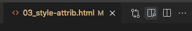

<!-- _class: cover -->

<h1 class="logo"><b>CODE</b>_THE_WEB #2</h1>
<p class="title">コードでウェブをつくろう #2</p>
<p class="author">&copy; 2025 Satoshi Soma</p>

---

## 前回のおさらい 1/4
- ほぼ全てのウェブページは **HTML コード** でできている
  - 画像や動画などの素材はページを構成する*部品*にすぎない
  - 部品をただ並べるだけではサイトはできない
  - *部品を正しく構成*し、サイトとして組み上げるのが HTML コードの役割
- HTML コード（ページのナカミ）は、
  ブラウザの**開発者ツール** `alt (option) + ⌘ + I` で覗ける

---

## 前回のおさらい 2/4
- どんな言語（日本語, 英語, 中国語など）にも必ず**文法**というルールが存在する
- HTML コードとは、*HTML という言語*の文法に従って書かれたテキスト（文字情報）
- HTML の文法は、様々な種類の **タグ (tag)** で成り立っている
- タグとはこういったもの達:
  - `<html>`, `<head>`, `<body>`, `<h1>`, `<p>` (その他多数)

---

## 前回のおさらい 3/4
- タグの書き方:

```html
<タグ名>テキスト</タグ名>
```

- `</タグ名>` これは**閉じタグ**（スラッシュに注目）
- *タグ* と *閉じタグ* は *1 セット* になっている（例外あり）
- タグと閉じタグで**囲まれたテキスト**に対して、
  何らかの*意味*や*機能*を付与することができる。

基本的なタグの用例については [`01_tags.html`](../01_tags.html) のコードを参照。

---

## 前回のおさらい 4/4
- タグには **属性 (Attribute)** を持たせることができる
- 属性とは、タグに与える*付加的な情報*。タグの機能を補完する役割を持つ
- 属性の書き方:

```html
<タグ名 属性名="属性値">
```

- *属性名* と *属性値* は *1セット* になっている

---

### 属性の用例

*例1:* `<a>` タグと `href` 属性を使った *リンク* の書き方:
```html
<a href="リンク先のURL">リンクテキスト</a>
```

*例2:* `` タグと `src` 属性を使った *画像* の置き方:
```html

```

尚、`` タグに閉じタグは存在しないので注意。

その他の用例については [`02_attributes.html`](../02_attributes.html) のコードを参照。

---

# プラグインで作業を効率化しよう

---

自分が書いた HTML コードの動作を確認する際、
これまではブラウザで `.html` ファイルを開いて確認してきたが、
ここからは **VS Code のプラグイン**を利用し、
**確認作業を簡略化**してみよう。

---

#1 にて日本語化プラグインを導入した時を思い出してほしい。
VS Code に新しいプラグインを導入したい時は、
ウィンドウ左端の 「*Extensions（拡張機能）*  」アイコンをクリックし、
検索欄にキーワードを入れ、出てきた候補から目ぼしいものを選びインストールする。

<hr>

今回は *Microsoft* 製の **「Live Preview」** プラグインをインストールしよう。


---

HTML コードを編集している際、*Live Preview* プラグインを利用することで、
**VS Code 上で編集結果を確認（プレビュー）** することができる。
いちいちブラウザに切り替える手間が省けるというわけだ。

### 使い方

1. VS Code で HTML ファイルを開く
2. *ウィンドウ右上*の「**プレビューの表示**」ボタンをクリック

<small style="margin-left: 245px">↓ 虫眼鏡のアイコン</small>


3. ウィンドウ右半分にプレビューが表示される

---

素晴らしいことに、
プレビューは HTML コードを編集する傍ら**リアルタイムで更新**される。
**本人の書いたコードの結果がすぐさまフィードバックされて確認できる**
という環境は、作業スピードのみならず、
**クオリティの高いコードを書き上げる**上でも非常に重要だ。

是非とも活用してほしい。

---

# スタイル (Style)

---

## style 属性
- タグの **デザインを指定** する属性
- そのタグで囲まれた部分の *見た目* を自由にカスタマイズできる
  - フォント, 文字サイズ, 文字色
  - レイアウト, 余白, 幅, 高さ
  - 背景色, 背景画像, テクスチャ, アニメーション, など

---

### style 属性の書き方

```html
<タグ名 style="プロパティ: 値">テキスト</タグ名>
```

- `プロパティ` とは、*フォントサイズ*や*文字色*といった、
**見た目のどの部分**を変えたいかを指定するもの
- `値` は、その部分を**どのように変えたいか**を指定するもの

<hr>

*例:* `<h1>` タグを <span style="color: red">赤文字</span> にする
```html
<h1 style="color: red">見出し</h1>
```

---

## 演習
[`03_style-attrib.html`](../03_style-attrib.html) を `WORKSPACE` フォルダにコピーし、
エディタで開く。サンプルコードを参照しながら、問題を解こう。
Live Preview を活用するのも忘れずに。

---

## style 属性の欠点
- **その style 属性を書いたタグにしか適用されない**
- *共通のデザイン*を適用したいタグが複数ある場合、**コピペするしかない**
- その共通のデザインに*途中で変更を加えたくなった*場合、
  *コピペした style 属性の値を全て変更しなくてはならない*

<hr>

*悪い例（コピペ地獄）:*
```html
<p style="font-size: 16px">2022年 11月 24日 木曜日 ...</p>
<p style="font-size: 16px">2022年 11月 23日 水曜日 ...</p>
<p style="font-size: 16px">2022年 11月 20日 日曜日 ...</p>
<p style="font-size: 16px"> ... </p>
...
```

---

## `<style>` タグ と CSS

---

### `<style>` タグ
- **複数のタグに対してまとめてスタイルを適用**することができる仕組み
- *`<style>`* と *`</style>`* の間に「**CSS**」というコードを記述する

```html
<style>
ここに CSS を記述
ここに CSS を記述
ここに CSS を記述
</style>
```

- *CSS* は HTML とは *別の言語*（文法が違う）
- CSS は *Cascading Style Sheets（カスケーディング・スタイルシート）* の略

---

### CSS の基本文法
```html
<style>
タグ {
  プロパティ: 値;
  プロパティ: 値;
  プロパティ: 値;
}
</style>
```

- `タグ` の部分には **スタイルを適用させたいタグ** の名前を書く。
- `プロパティ` は *`font-size`* や *`color`* など、**変えたい部分** を指定する。
- `値` には希望の *数値* や *色* などを入力する。

---

#### 用例1:
```html
<style>
p {
  color: green;    /* 文字色:グリーン */
  font-size: 14px; /* 文字サイズ:14px */
}
a {
  font-weight: bold; /* 太字 */
}
</style>

<p>このテキストは緑色</p>
<p>これも緑色</p>
<a href="xxxx">このリンクは太字</a>
<a href="xxxx">これも太字</a>
```

ちなみに、`/*` と `*/` で挟まれた部分は**コメント**として扱われる。

---

#### 用例2:
```html
<style>
body {
  background-color: black; /* 背景色:黒 */
  color: white;            /* 文字色:白 */
}
a {
  color: greenyellow; /* 黄緑色 */
}
</style>

背景は黒, テキストは白
<a href="xxxx">このリンクは黄緑色</a>
```

`<body>` タグに対して指定したスタイルは**ページ全体に適用**される。
*`background-color`* は**背景色を指定するプロパティ**なので、
この例だと*ページ全体が真っ黒*になり、*基本の文字色は白*になる。
そして `<a>` タグの文字色だけ*黄緑色で上書き*される。

---

### 表示を確認してみよう
1. `00_base.html` を `WORKSPACE` フォルダ内にコピーする
2. `WORKSPACE/00_base.html` を `test.html` にリネーム
3. `WORKSPACE/test.html` をエディタで開く
4. 「*用例1*」を **`<body>` タグ内にコピペ** する
5. Live Preview で正しい表示になっているか確認する
6. 「*用例2*」についても同様に確認する

---

## CSS における色の表現
ここまでの記述例では、背景色や文字色に対して
`green` や `black`, `white` といった色の名前を指定してきたが、
次に示す指定方法を用いることで、より多彩で自由な色表現が可能となる。

---

### RGB 値
```css
color: rgb(255, 0, 0);     /* 赤 */
color: rgb(0, 255, 0);     /* 緑 */
color: rgb(0, 0, 255);     /* 青 */
color: rgb(0, 0, 0);       /* 黒 */
color: rgb(255, 255, 255); /* 白 */
```

RGB に **A (アルファ)** を加えると **不透明度 (0.0 から 1.0)** を表現できる。

```css
color: rgba(255, 0, 0, 0.5); /* 半透明の赤 */
```

---

### HSL 値
H = 色彩 (0 から 360)
S = 彩度 (0% から 100%)
L = 明度 (0% から 100%)

```css
color: hsl(120, 100%, 40%); /* 緑 */
```

HSL に **A (アルファ)** を加えると
**不透明度 (0.0 から 1.0)** を表現できる。

```css
color: hsla(120, 100%, 40%, 0.5); /* 半透明の緑 */
```


---

## 演習:
自分のサイトのデザインの考案とコーディングを進めてください。
スタイルシートをあれこれいじって、
*理想の色やフォントなどのイメージを模索*してみてください。

今はまだラフスケッチの段階でも大丈夫です。
なるべく**具体的なイメージ**を固めてください。

「こうしたいけどコーディングの仕方がわからない」
などの質問は受け付けます。
他のサイトのマネをしても構いません。
（ただし、コピペは無し）
