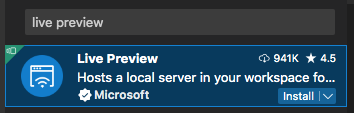

<div id="cover">
  <h1 class="logo"><b>CODE</b>_THE_WEB #2</h1>
  <p class="title">コードでウェブをつくろう #2</p>
  <p class="author">&copy; 2022 Satoshi Soma</p>
</div>

---

## 前回のおさらい 1/4
- あらゆるウェブページは基本的に **HTML コード**でできている
    - 画像や動画などの素材は**ページを構成する部品**にすぎない
    - 部品をただ並べるだけではサイトはできない
    - 部品を**正しく構成**し、サイトとして組み上げるのが **HTML コード**の役割
- HTML コード（ページのナカミ）は、
ブラウザの**開発者ツール** `alt + ⌘ + I` で覗ける

---

## 前回のおさらい 2/4
- どんな**言語**（日本語, 英語, 中国語など）にも必ず**文法というルール**が存在する
- **HTML コード**とは、**HTML という言語**の文法に従って書かれたテキスト（文字情報）
- HTML の文法は、様々な種類の **タグ (tag)** で成り立っている
- タグはこういうやつら:
    - `<html>`, `<head>`, `<body>`, `<h1>`, `<p>` (他にも沢山ある)

---

## 前回のおさらい 3/4
- タグの書き方:
    - `<タグ名>テキスト</タグ名>`
    - `</タグ名>` これは**閉じタグ**（スラッシュに注目）
    - *タグ*と*閉じタグ*は*ワンセット*になっている（例外あり）
    - タグと閉じタグで**囲まれたテキスト**に対して、
    何らかの**意味**や**機能**を付与することができる。

基本的なタグの用例については [`01_tags.html`](01_tags.html) のコードを参照。

---

## 前回のおさらい 4/4
- タグには **属性 (attribute)** を持たせることができる
- 属性とは、タグに与える**付加的な情報**（パラメタ）
- 属性の書き方:
    - `<タグ名 属性名="属性値">`

例1: `<a>`タグと `href`属性を使った**リンク**の付け方:
```html
<a href="リンク先のURL">リンクテキスト</a>
```

例2: ``タグと `src`属性を使った**画像**の置き方:
```html

```

その他用例については [`02_attributes.html`](02_attributes.html) のコードを参照。

---

## プラグインで作業を効率化しよう
自分で書いた HTML コードを確認する際、
これまではブラウザで `.html` ファイルを開いて確認してきたが、
ここからは **VS Code のプラグイン**を利用することで、
**確認作業を簡略化**してみよう。

---

#1 にて日本語化プラグインを導入した時を思い出してほしい。
VS Code に新しいプラグインを導入したい時は、
ウィンドウ左端の 「*Extensions（拡張機能）*  」アイコンをクリックし、
検索欄にキーワードを入れ、出てきた候補から目ぼしいものを選び、
インストールすればいい。

<hr>

今回は *Microsoft* 製の **「Live Preview」** プラグインをインストールする。



---

HTML コードを編集している際、*Live Preview* プラグインを利用することで、
**VS Code 上で編集結果を確認（プレビュー）** することができる。
いちいちブラウザに切り替える手間が省けるというわけだ。

### 使い方

1. VS Code で HTML ファイルを開く
2. *ウィンドウ右上*の「**プレビューの表示**」ボタンをクリック

<small>（真ん中のアイコン ↓）</small>


3. ウィンドウ右半分にプレビューが表示される

---

素晴らしいことに、
プレビューは HTML コードを編集する傍ら**リアルタイムで更新**される。
**本人の書いたコードの結果がすぐさまフィードバックされて確認できる**
という環境は、作業スピードのみならず、
**クオリティの高いコードを書き上げる**上でも非常に重要だ。

是非とも活用してほしい。

---

## style 属性
- **どんなタグ**にも持たせることができる
- そのタグで囲まれた部分の**見た目**を自由にいじれる
  - フォント, 文字サイズ, 文字色
  - レイアウト, 余白, 幅, 高さ
  - 背景色, 背景画像, テクスチャ, アニメーション, など

---

## style 属性の書き方

```html
<タグ名 style="プロパティ: 値">テキスト</タグ名>
```

- `プロパティ` とは、**フォントサイズ**や**文字色**といった、
**見た目のどの部分**を変えたいかを指定するもの
- `値` は、その部分を**どのように変えたいか**を指定するもの

---

## 演習
[`03_style-attrib.html`](03_style-attrib.html) を `WORKSPACE` フォルダにコピーし、
ブラウザとエディタ双方で開く。
サンプルコードを参照しながら、問題を解こう。

---

## style 属性の欠点
- **その style 属性を書いたタグにしか適用されない**
- *共通のデザイン*を適用したいタグが複数ある場合、**コピペするしかない**
- その共通のデザインに*途中で変更を加えたくなった*場合、
  **コピペした style 属性の値を全て変更しなくてはならない**

```html
<p style="font-size: 16px">2022年 11月 24日 木曜日 ...</p>
<p style="font-size: 16px">2022年 11月 23日 水曜日 ...</p>
<p style="font-size: 16px">2022年 11月 20日 日曜日 ...</p>
<p style="font-size: 16px"> ... </p>
...
```
<small>「コピペ地獄… 」</small>

---

## `<style>` タグ と スタイルシート
- **複数のタグに対してまとめてスタイルを適用**することができる仕組み
- `<style>` と `</style>` の間に「**スタイルシート**」というコードを記述する
- 「*スタイルシート*」は **HTML とは別の言語**（文法が違う）

```html
<style>
  ここにスタイルシートを記述する
</style>
```

---

## スタイルシートの基本文法
```html
<style>
タグ {
    プロパティ: 値;
    プロパティ: 値;
    プロパティ: 値;
}

別のタグ {
    (同上)
}
</style>
```

---

### スタイルシートを活用した HTML の記述例
```html
<style>
p {
  color: green;    /* 文字色:グリーン */
  font-size: 14px; /* 文字サイズ:14px */
}

a {
  font-weight: bold; /* 太字 */
}
</style>

<p>このテキストはグリーン</p>
<p>これもグリーン</p>
<a href="https://google.com">このリンクは太字</a>
<a href="https://apple.com">これも太字</a>
```