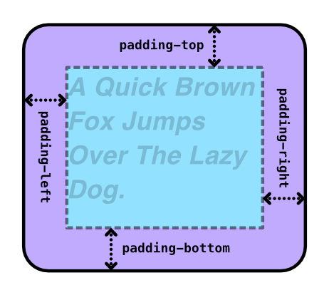
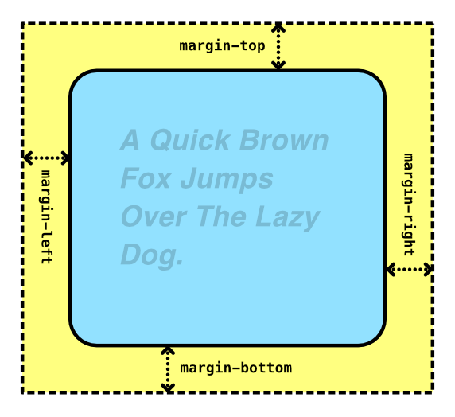

<!-- _class: cover -->

<h1 class="logo"><b>CODE</b>_THE_WEB #4</h1>
<p class="title">コードでウェブをつくろう #4</p>
<p class="author">&copy; 2025 Satoshi Soma</p>

---

## 前回のおさらい 1/6
*`class` 属性 (HTML)*

```html
<タグ名 class="クラス名"> ... </タグ名>
```

```html
<タグ名 class="クラスA クラスB"> ... </タグ名> <!-- スペースを挟んで複数のクラス -->
```

- タグに「**クラス名（分類名）**」を与える。
- 「クラス名」は*自由*だが**半角英数**を推奨。
- `class` 属性そのものに特別な機能は無い。
- CSS において、クラス名を**スタイルの適用先**として指定できる。

---

## 前回のおさらい 2/6
*`クラス名` に対してスタイルを適用する (CSS)*

```css
.クラス名 {
  プロパティ: 値;
  プロパティ: 値;
  プロパティ: 値;
}
```

- *`.`（ピリオド）の後にクラス名* を書いて指定する（セレクタ）。
- **そのクラスに属する全てのタグ**に対して、`{ }` 内のスタイルが適用される

```css
.alfa {
  font-size: 21px; /* alfa クラスの文字サイズを 21px に */
}
```

参考: [04_class.html](../04_class.html)

---

## 前回のおさらい 3/6
CSS において、*`{` の直前*の部分は「**セレクタ**」と呼び、
`{ }` 内に書いたスタイルの**適用範囲**を指定している。

セレクタには*様々な書き方*が存在する。

```css
p { （省略） }           /* タグ名による指定 */
```
```css
.alfa { （省略） }       /* クラス名による指定 */
```
```css
p.alfa { （省略） }      /* タグ名とクラス名による指定 */
```
```css
h1, h2, h3 { （省略） }  /* カンマ区切りでまとめて指定 */
```
```css
.alfa p { （省略） }     /* alfa クラスに内包された <p> タグ */
```

---

## 前回のおさらい 4/6
*`<div>` と `<span>` タグ (HTML)*
- **特別な役割や機能を持たない**
- `<div>` は「*ブロック要素*」
- `<span>` は「*インライン要素*」

*主な用途:*
一つまたは複数の HTML 要素（テキストやタグ）を*囲む*ことで、
**一つのグループとしてまとめる**。
（Adobe Illustrator や Photoshop における**グループ**や**レイヤー**の感覚に近い。）

参考: [05_div-and-span.html](../05_div-and-span.html)

---

## 前回のおさらい 5/6
*ブロック (block) 要素とは*
- `<body>`
- `<div>`
- `<h1>`, `<h2>`, `<h3>`, ... `<h6>`
- `<p>`
- `<hr>` など

*特徴:*
- 強制的に改行される（**常に新しい行に挿入される**）
- 内容に関わらず**幅が最大の矩形**で表示される（スタイルで変更可能）

---

## 前回のおさらい 6/6
*インライン (inline) 要素とは*
- `<span>`
- `<a>`
- ``
- `<strong>` など

*特徴:*
- 改行されない（改行するには `<br>` タグが必要）
- 幅が**内容次第**
- 内容が最大幅を超えると*折り返される*

---

# 実践 CSS

---

前回、ウェブページを「*ヘッダー*」「*メイン*」「*フッター*」
という三つのパーツに分け、HTML コーディングを行なった。

これらはウェブページ全体にとって最も基本的な**骨組み**といえる部分となる。
これから*細部に肉付け*を行なっていくことでウェブサイトとしての体裁を
整えていくことになる。

今回は、*スタイルシート*を使って骨組みの HTML に*デザインを適用*し、
**ページ全体の大まかな外観イメージ**を形作ってみよう。

---

まずは *`<style>` タグ*を記述する。
`<style>` タグの場所は基本的に*どこでもいい*のだが、
わかりやすいように*ヘッダーのすぐ上*に書いておこう。

```html
<!-- スタイルシート -->
<style>

</style>

<!-- ヘッダー -->
<div class="header">
  ...
```

以降、スタイルシート（CSS）は全てこの `<style>` タグ内に記述していく。

---

## 基本スタイルの設定
最初に、*ページ全体で共通*する基本の文字設定を行う。
この設定は *`<body>` タグ*に対して適応するのがいいだろう。

```css
body {
  /* フォント */
  font-family: Helvetica, Arial, sans-serif;

  font-size: 16px;   /* 文字サイズ */
  line-height: 1.75; /* 行の高さ */
}
```

`<body>` タグを指定する理由は、
CSS には「**親要素に設定されたスタイルは子要素に引き継がれる**」
という性質が存在し、`<body>` が基本的に*ほぼ全てのタグの親*にあたるためだ。

---

*`font-family` プロパティ*は、`,` 区切りで複数のフォント名を指定できる。

```css
font-family: Helvetica, Arial, sans-serif;
```

最初のフォント（この場合 `Helvetica`）が
*サイト閲覧者の環境にインストールされていれば*、そのフォントで表示される。

そうでなければ次のフォント（この場合 `Arial`）が... という具合だ。

`sans-serif` はフォント名ではなく、
「サンセリフ体」という*カテゴリ*での指定を意味するキーワードだ。
実際にどのフォントが選択されるかは*閲覧者の環境依存*となる。
そのため、*最後（一番右）* に指定するのが望ましいといえる。

---

*`line-height` プロパティ*は一行の高さを指定する。

```css
line-height: 1.75;
```

値を `1.75` とした場合、一行が **1.75 文字分**の高さとなる。
といっても、*文字が縦に引き伸ばされるというわけではなく*、
その分**行間が空く**ということを意味する。

だいたい `1.5` から `2.0` までの間で指定すれば読みやすい行間になるだろう。

---

## ヘッダーのスタイル
ヘッダーはサイトのアイデンティティを担う要素でもあるので、
デザインにはある程度こだわりたい所だ。
*閲覧者に強い印象を残せれば、二度目も訪れてくれる可能性が上がる。*

セレクタには*クラス名 `header`* を指定すればいい。

```css
.header {

}
```

---

まずは `padding` プロパティで適切に**余白**を設定しよう。

```css
.header {
  padding: 30px 40px; /* 余白: 上下 左右 */
}
```

値を**スペース区切りで二つ**記述すると、
それぞれ「*上下*」と「*左右*」の余白の指定となる。

---

ヘッダーに**背景色**をつけてみるのもいいだろう。
多少大胆な色づかいでも、ヘッダーだけならサイト全体の見やすさには影響が少ないし、
サイトの**テーマカラー**としても機能させることができる。

```css
.header {
  padding: 30px 40px; /* 余白: 上下 左右 */

  background-color: rgb(0, 159, 181); /* 背景色 */
  color: white; /* 文字色 */
}
```

文字が背景に溶け込まないように、適切な文字色を設定するのも忘れずに。

---

ヘッダーに背景色を設定したところで、*ページの左上と右上に
白い隙間*があることに気づいただろうか？

実は `<body>` タグには*デフォルトのスタイル*として

```css
margin: 8px;
```

が設定されていて、この隙間はその設定によるものだ。

この隙間を無くすには `body` に `margin: 0;` を適用すればいい。

```css
body {
  margin: 0; /* 隙間を無くす */

  （省略）
}
```

---

次にサイトのタイトルをデザインしてみよう。
セレクタには*クラス名 `title`* を使う。

```css
.title {
  /* タイトル用フォント*/
  font-family: Futura, "Century Gothic", sans-serif;

  font-size: 32px;
  font-weight: bold; /* 太字 */
  letter-spacing: 0.1em; /* 文字間隔 */
}
```

タイトルには `body` に設定した基本フォントとは**違うフォント**を
使用してみるのもいいだろう。

*スペースを含むフォント名は `"` で囲む*のを忘れずに。

他にもサイズを大きくしたり、太字にするなど、
とにかく**他のテキストと差別化**させるのがポイントだ。

---

## メインのスタイル
メインのエリアにも、ヘッダー同様に適切な余白を設定しよう。
ページの主要コンテンツを表示するエリアなので、
上のヘッダーと下のフッターに対して、*やや広めの余白*を取ることをお勧めする。

```css
.main {
  padding: 60px 40px; /* 余白: 上下 左右 */
}
```

---

### 見出しのスタイル
ブログ系のサイトの場合、記事の見出しは重要だ。
訪問者の興味を引きつけ、本文に誘導するため、
インパクトのあるデザインを考えてみよう。

```css
.main h1 {
  font-size: 64px;           /* デカ文字 */
  text-align: right;         /* 文字右寄せ */
  color: rgba(0, 0, 0, 0.4); /* 文字色（半透明） */

  /* 境界線（下）*/
  border-bottom: 4px solid rgba(0, 0, 0, 0.2);
    /* 太さ:4px    スタイル: solid（直線）    色: 半透明の黒 */
}
```

この例では、フォントサイズを思い切って巨大にしてみた。
ただ、文字色が黒のままだと主張が激しすぎるので、透明度をつけた。
ついでに `border-bottom` で下線を付けて強調してみた。

---

## フッターのスタイル
フッターにも、ヘッダー同様 `padding` で余白を取ろう。

ついでに、ヘッダーとは別の背景色を割り当て、
ページ全体で*トライカラー*の構成にしてみようと思う。

```css
.footer {
  padding: 30px 40px;      /* 余白 */
  background-color: black; /* 背景色2 */
  color: white;            /* 文字色 */
}
```

---

### 問題発生
しかし、フッターが最下部に固定されているわけではないので、
ウィンドウの高さに対して**ページの全体の高さが足りない**場合、
フッターより下に白背景が突き出てしまうため、
そのままでは*意図通りのデザインにならない*。

---

### 解決
この場合、`body` に **フッターと同じ背景色** を適用することでページ全体を塗り、
「メイン」の背景色には `white` を適用することで問題を解決できる。

```css
body {
  background-color: black; /* 背景色2 */
}
```

```css
.main {
  background-color: white; /* 白背景 */
}
```

---

## 様々な CSS プロパティとスタイリングテクニック

---

### `display` プロパティ
役割: タグの表示形式（ `block`, `inline` など）を変える。

例: `<p>` を `inline` 要素に変更（元は `block` 要素）
```css
p {
  display: inline;
}
```

例: `<a>` を `block` 要素に変更（元は `inline` 要素）
```css
a {
  display: block;
}
```

`sandbox.html` を編集して、表示の変化を確認してみよう。

---

### ブロックの幅と高さを変更
**`width`** プロパティ:
- 幅の指定 (単位: `px`, `em`, `%` など)

**`height`** プロパティ
- 高さの指定 (単位: `px`, `em`, `%` など)

```css
div {
  width: 240px; /* 幅: 240px */
  height: 4em;  /* 高: 4文字分 */
}
```

`%` で指定すると、**親要素のサイズに対する割合**として計算される。

---

### 余白
**`padding`** プロパティ:
- 余白の指定（単位: `px`, `em` など）
- 余白は要素の**内側**に作られる。

<div class="cols c32">

```css
div {
  padding: 1em;             /* 周囲に 1em 分の余白 */
  padding: 1em 2em;         /* 上下: 1em, 左右: 2em */
  padding: 1em 2em 3em 4em; /* 上から時計回りに指定 */

  padding-top:    1em;      /* 上のみ */
  padding-bottom: 1em;      /* 下のみ */
  padding-left:   1em;      /* 左のみ */
  padding-right:  1em;      /* 右のみ */
}
```


</div>

---

### 隙間（マージン）
**`margin`** プロパティ:
- 隙間の指定（単位: `px`, `em` など）
- 隙間は要素の**外側**に作られる。

<div class="cols c32">

```css
div {
  margin: 1em;             /* 周囲に 1em 分の隙間 */
  margin: 1em 2em;         /* 上下: 1em, 左右: 2em */
  margin: 1em 2em 3em 4em; /* 上から時計回りに指定 */

  margin-top:    1em;      /* 上のみ */
  margin-bottom: 1em;      /* 下のみ */
  margin-left:   1em;      /* 左のみ */
  margin-right:  1em;      /* 右のみ */
}
```


</div>

---

### `padding` と `margin` の違い
この二つは混同されがちだが、**役割が明確に違う**ので注意。

"padding" とは「**詰め物**」という意味。
要素の内側に*見えない詰め物*を入れて、**幅と高さを水増し**する。

`margin` は**要素と要素の間に隙間を空ける**のが目的。
要素の外側に**不可侵領域**を設定する。
**他の要素に対してどれだけ距離を置くか**を指定するプロパティだといえる。
位置を微調整する目的でも使われることが多い。

---

### 絶対配置
**`position`** プロパティに **`absolute`** と指定することで、
その要素の配置を **絶対座標** で指定することができるようになる。

実際の座標の指定には
**`top`**, **`left`**, **`right`**, **`bottom`** プロパティを用いる。

```css
div {
  position: absolute;
  top:  10px; /* 上から 10px */
  left: 20px; /* 左から 20px */
}
```

絶対指定なので、**他の要素を完全に無視**して配置される。

---

<style scoped>
.item-list {
  display: flex;
}
.item {
  background-color: #ccc;
  padding: 5px 10px;
}
.item:nth-child(1) {
  background-color: hsl(0, 80%, 90%);
}
.item:nth-child(2) {
  background-color: hsl(90, 80%, 90%);
}
.item:nth-child(3) {
  background-color: hsl(180, 80%, 90%);
}
</style>

### フレックスボックス (Flex Box)
**`display`** プロパティに **`flex`** を指定すると、
**直下のブロック要素を横並び**に配置することができる。

<div class="cols c32">
<div>

```html
<div class="item-list">
  <div class="item">Item 1</div>
  <div class="item">Item 2</div>
  <div class="item">Item 3</div>
</div>
```

```css
.item-list {
  display: flex;
}
```

</div>
<figure>
<div class="item-list">
  <div class="item">Item 1</div>
  <div class="item">Item 2</div>
  <div class="item">Item 3</div>
</div>
</figure>
</div>

---

<style scoped>
.item-list {
  display: flex;
  gap: 20px;
}
.item {
  background-color: #ccc;
  padding: 5px 10px;
}
.item:nth-child(1) {
  background-color: hsl(0, 80%, 90%);
}
.item:nth-child(2) {
  background-color: hsl(90, 80%, 90%);
}
.item:nth-child(3) {
  background-color: hsl(180, 80%, 90%);
}
</style>

さらに、`gap` プロパティで **各子要素の隙間** を指定することができる。

<div class="cols c32">
<div>

```css
.item-list {
  display: flex;
  gap: 20px; /* 各要素の隙間 */
}
```

</div>
<figure>
<div class="item-list">
  <div class="item">Item 1</div>
  <div class="item">Item 2</div>
  <div class="item">Item 3</div>
</div>
</figure>
</div>
