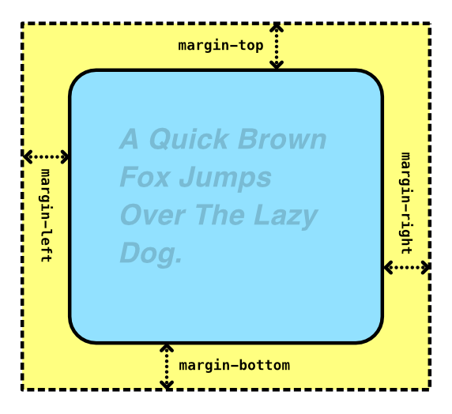

<!-- _class: cover -->

<h1 class="logo"><b>CODE</b>_THE_WEB #5</h1>
<p class="title">コードでウェブをつくろう #5</p>
<p class="author">&copy; 2025 Satoshi Soma</p>

---

<style scoped>
figure {
  font-size: 1.25em;
  font-weight: bold;
  font-style: italic;
}
figure span,
figure div {
  color: #0004;
}
.a {
  background-color: #fcc;
}
.b {
  background-color: #cfc;
}
.c {
  background-color: #ccf;
}
</style>

## 前回のおさらい 1/3

#### インライン要素

<div class="cols">

<figure>
<span class="a">A Quick Brown Fox</span>
<span class="b">Jumps Over</span>
<span class="c">The Lazy Dog.</span>
</figure>

<div>

- `<span>`, `<a>`, `<strong>`, ``, etc.
- 幅が内容次第。
- 勝手に改行されない。
- 一行に収まりきらない分は折り返される。

</div>

</div><!-- /cols -->

#### ブロック要素

<div class="cols">

<figure>
<div class="a">A Quick Brown Fox</div>
<div class="b">Jumps Over</div>
<div class="c">The Lazy Dog.</div>
</figure>

<div>

- `<div>`, `<p>`, `<h1>`, etc.
- 内容に関わらず、幅が最大になる。
- 常に新しい行に表示される。

</div>

</div><!-- /cols -->

---

## 前回のおさらい 2/3

**`padding`** プロパティ:
- 余白の指定（単位: `px`, `em` など）
- 余白は要素の**内側**に作られる。

<div class="cols c32">

```css
div {
  padding: 1em;             /* 周囲に 1em 分の余白 */
  padding: 1em 2em;         /* 上下: 1em, 左右: 2em */
  padding: 1em 2em 3em 4em; /* 上から時計回りに指定 */

  padding-top:    1em;      /* 上のみ */
  padding-bottom: 1em;      /* 下のみ */
  padding-left:   1em;      /* 左のみ */
  padding-right:  1em;      /* 右のみ */
}
```


</div>

---

## 前回のおさらい 3/3

**`margin`** プロパティ:
- 隙間の指定（単位: `px`, `em` など）
- 隙間は要素の**外側**に作られる。

<div class="cols c32">

```css
div {
  margin: 1em;             /* 周囲に 1em 分の隙間 */
  margin: 1em 2em;         /* 上下: 1em, 左右: 2em */
  margin: 1em 2em 3em 4em; /* 上から時計回りに指定 */

  margin-top:    1em;      /* 上のみ */
  margin-bottom: 1em;      /* 下のみ */
  margin-left:   1em;      /* 左のみ */
  margin-right:  1em;      /* 右のみ */
}
```


</div>

---

## スタイルシートを別ファイルに
HTML とスタイルシートのコーディングを進めていると、次第に *HTML ファイル全体が長く*なっていき、結果として作業に支障が出ることがある。

そこで `<style>` タグ内に書いた CSS コードを、**スタイルシート専用のファイル**に移動させ、それを *HTML ファイルから読み込ませる*ことにしよう。

---

### CSS ファイル
まずは**空の CSS ファイル**を作成しよう。
VS Code 上で新しいファイルを作成するには、

1. 作りたい先のフォルダを右クリック
2. `新しいファイル` をクリック
3. ファイル名を入力する。

今回は `WORKSPACE` フォルダ内に **`style.css` という名前**でファイルを作成しよう。

---

ファイルが作成されると、自動的にそのファイルがエディタ上に開かれるので、
最初に以下のコードをエディタ内に書き込む。

```css
@charset "utf-8";
```

これは、その CSS ファイルの**文字コード**を指定するものだ。文字コードが適切に設定されていないと、コメント内に書いた日本語などが**文字化け**してしまう原因となる。

*`utf-8`* は広範な言語に対応した文字コードで、ウェブ制作においてはこれを選んでおけば大抵問題ない。

---

次に、スタイルシートを `style.css` 内に移動させる。
<small>（操作に不慣れな人は事前に `WORKSPACE/index.html` のバックアップを取っておくことを推奨。）</small>

1. `WORKSPACE/index.html` の **`<style>` タグの中身**を全て選択し、
**切り取り <kbd>⌘</kbd> + <kbd>X</kbd>**
2. 空になった `<style>` タグを削除<small>（閉じタグも消すのを忘れずに）</small>
3. 先ほど作成した `WORKSPACE/style.css` の
*`@charset "utf-8";` の下*に**貼り付け <kbd>⌘</kbd> + <kbd>V</kbd>** 、保存 <kbd>⌘</kbd> + <kbd>S</kbd>。

<hr>

あとは **`WORKSPACE/index.html` から `WORKSPACE/style.css` を読み込ませれば**いい。

---

HTML ファイルから CSS ファイルを読み込ませるには、
以下のような **`<link>` タグ**を、**`<head>` タグの中に記述**する。

```html
<link rel="stylesheet" href="CSSファイルへのパス">
```

パスは *`フォルダ名/ファイル名`* というルールで記述するが、
CSS ファイルが HTML ファイルと**同じフォルダ内**にある場合は、
**ファイル名だけ**を記述すればいい。

---

総合すると `<head>` タグは以下のようになる。

```html
<head>
  <title>タイトル</title>
  <link rel="stylesheet" href="style.css">
</head>
```

保存したら、念のため `WORKSPACE/index.html` をブラウザで表示してみよう。
スタイルが正しく適用されていれば成功だ。

---

今後は、

- ページのコンテンツの追加・修正は `index.html` を、
- レイアウトや装飾などのデザイン調整は `style.css` を

それぞれ目的に合わせて編集していくことになる。

`<style>` タグが無くなった分 `index.html` のコード全体が短くなり、
**コンテンツの編集のみに注力**することができるようになるだろう。

---

なお、VS Code 上で頻繁にタブを切り替える場合は、
**ショートカットキー**を利用することをお勧めする。

<kbd>control</kbd> + <kbd>tab</kbd> で**直前に表示していたタブに戻れる**ので、
HTML ファイルと CSS ファイルを行ったり来たりする際に非常に有用である。

また、
<kbd>⌘</kbd> + <kbd>option</kbd> + <kbd>←</kbd> で**一つ左のタブ**に、
<kbd>⌘</kbd> + <kbd>option</kbd> + <kbd>→</kbd> で**一つ右のタブ**に移動することもできる。

ショートカットキーを活用することで**キーボードから手を離す頻度が減るため**、
**集中力を切らさず、コーディングに没頭**することができる。

---

## 16 進数カラーコード
#2 にて、*RGB* 値と *HSL* 値による色の表記法を学習したが、
CSS にはさらに **16 進数** を用いた表記法も存在する。

形式は **`#` に続く 6 桁の数字**が基本形だ。

```css
color: #112233;
```

この 6 桁の数字が何を意味するのかを解説するには、
先に*16 進数*について説明しておく必要があるだろう。

---

### 16 進数
16 進数とは数値の表現方法の一つで、**一桁を 16 個の数字で表す**ことができる。
`9` より大きい数字として **`a` から `f` までのアルファベット**を用いる。

<table class="numtable">
  <tr>
    <th>10 進数</th>
    <td>0</td>
    <td>1</td>
    <td>2</td>
    <td>3</td>
    <td>4</td>
    <td>5</td>
    <td>6</td>
    <td>7</td>
    <td>8</td>
    <td>9</td>
    <td colspan="6"></td>
  </tr>
  <tr>
    <th>16 進数</th>
    <td>0</td>
    <td>1</td>
    <td>2</td>
    <td>3</td>
    <td>4</td>
    <td>5</td>
    <td>6</td>
    <td>7</td>
    <td>8</td>
    <td>9</td>
    <td>a</td>
    <td>b</td>
    <td>c</td>
    <td>d</td>
    <td>e</td>
    <td>f</td>
  </tr>
</table>

<small>（アルファベットに大文字と小文字の区別は無い。）</small>

例えば、`9` という数値は 16 進数でも `9` と書けるが、
`10` という数値は *16 進数では `a`* と書き、
`15` なら *`f`* と書く。**`0` から `15` までの数値を一桁で表現できる**というわけだ。

---

`16` になるとようやく桁が上がり、*`10`* と表現される。
表にすると以下のようになる。

<table class="numtable">
  <tr>
    <th>10 進数</th>
    <td>15</td>
    <td>16</td>
    <td>17</td>
    <td>18</td>
    <td>…</td>
    <td>29</td>
    <td>30</td>
    <td>31</td>
    <td>32</td>
    <td>…</td>
    <td>160</td>
    <td>161</td>
    <td>162</td>
    <td>…</td>
    <td><b>255</b></td>
  </tr>
  <tr>
    <th>16 進数</th>
    <td>f</td>
    <td>10</td>
    <td>11</td>
    <td>12</td>
    <td>…</td>
    <td>1d</td>
    <td>1e</td>
    <td>1f</td>
    <td>20</td>
    <td>…</td>
    <td>a0</td>
    <td>a1</td>
    <td>a2</td>
    <td>…</td>
    <td><b>ff</b></td>
  </tr>
</table>

`255` が 16 進数では **`ff`** となる点に注目してほしい。
これは 16 進数において **2 桁で表現できる最大の数**である。

---


カラーコードの解説に戻ろう。

```css
color: #000000;
```

`#` に続く 6 桁の数字は、

- *1, 2 桁目*が <b class="red">R（赤）</b>
- *3, 4 桁目*が <b class="green">G（緑）</b>
- *5, 6 桁目*が <b class="blue">B（青）</b>

を表す **16 進数値**である。


---

以下に例を示す。

```css
color: #ffffff; /* 白 = rgb(255, 255, 255) */
color: #ff0000; /* 赤 = rgb(255,   0,   0) */
color: #00ff00; /* 緑 = rgb(  0, 255,   0) */
color: #0000ff; /* 青 = rgb(  0,   0, 255) */
color: #808080; /* 灰 = rgb(128, 128, 128) */
```

`rgb( … )` と書くよりも、
 16 進数カラーコードのほうが**文字数が少なくて済む**という利点がある。

---

### 短縮記法
6 桁ではなく、**3 桁**で記述する*短縮記法*も存在する。

```css
color: #fff; /* #ffffff（白）*/
color: #f00; /* #ff0000（赤）*/
color: #0f0; /* #00ff00（緑）*/
color: #00f; /* #0000ff（青）*/
color: #123; /* #112233     */
```

---

### アルファ値（不透明度）
6 桁の後ろに **2 桁を追加**することで、
*アルファ値（不透明度）* の指定も行うことができる。

```css
color: #00000088; /* #000000 + 88（半透明 黒）*/
color: #00ff00ff; /* #00ff00 + ff（不透明 緑）*/
```

*7, 8 桁目*が不透明度となり、
`00` が完全に透明、**`ff (255)` に近づくほど不透明**になる。

---

### 短縮記法（アルファ値）
**4 桁**だと、**3 桁の短縮記法にアルファ値を加えた形**の記述と解釈される。

```css
color: #f008; /* #ff0000 + 88（半透明 赤）*/
color: #00ff; /* #0000ff + ff（不透明 青）*/
```

---

以上を表にまとめてみた。

| 桁数 | 記述例 | 意味 |
|----:|:------|:-----|
| 6 桁 | `#112233`   | <b class="red">R:11</b> <b class="green">G:22</b> <b class="blue">B:33</b> |
| 8 桁 | `#11223344` | <b class="red">R:11</b> <b class="green">G:22</b> <b class="blue">B:33</b> <b>A:44</b> |
| 3 桁 | `#123`      | <b class="red">R:11</b> <b class="green">G:22</b> <b class="blue">B:33</b> |
| 4 桁 | `#1234`     | <b class="red">R:11</b> <b class="green">G:22</b> <b class="blue">B:33</b> <b>A:44</b> |

16 進数カラーコードは桁数によって意味が変わってくるので注意しよう。
しかし、慣れてしまえば**少ないタイプ数で色を指定**することができるので、
是非活用してほしい。

---

## レイアウトの最適化
ウェブサイトの**閲覧環境**は人によって様々だ。
*ディスプレイサイズ*も*ウィンドウサイズ*も文字通りの千差万別。

それどころか、*スマホ*や*タブレット*など、
ブラウジング環境を備えた大小様々なデバイスも考慮に入れるならば、**「PC のブラウザ上」という保証すら全く無い**ということになる。

ゆえに、サイト制作者はあらゆる閲覧環境を想定に入れた上で
ページの**最適なレイアウトを設計し、実装**しなくてはならない。

---

### 現状の問題点
`WORKSPACE/index.html` を*ブラウザ*（プレビューではなく）で開き、
*ブラウザのウィンドウを最大化*してみよう。

現状のレイアウトだと、ページ全体が
**常にウィンドウの幅一杯**に広がって表示される。

それゆえウィンドウを最大化すると、
一般的なデスクトップ環境では**やや横に広がりすぎ**てしまう。

これを解決しよう。

---

### 横幅の制限
ストレートな解決方法としては、**横幅を制限したい要素を `<div>` で囲み**、
その `<div>` の「**最大幅**」をスタイルシートで指定する、という方法が考えられる。

まずは*ヘッダー*から解決していこう。

---

#### Before:
```html
<div class="header">
  <span class="title">CODE_THE_WEB Blog</span>
  <p>コードでウェブ制作を学ぶブログです</p>
</div>
```

#### After:
```html
<div class="header">
  <div>
    <span class="title">CODE_THE_WEB Blog</span>
    <p>コードでウェブ制作を学ぶブログです</p>
  </div>
</div>
```

---

*After* のコードを *Before* と見比べると、
**`<div class="header">` の直下に新しい `<div>`** が追加されているのがわかる。
そして、元々あった `<div class="header">` の*中身の要素*は、
全てこの新しい `<div>` に**包含される**形になる。

この `<div>` には、「*包む*」という意味で **`wrap` というクラス名**を付けよう。

```html
<div class="header">
  <div class="wrap">
    <span class="title">CODE_THE_WEB Blog</span>
    <p>コードでウェブ制作を学ぶブログです</p>
  </div>
</div>
```

---

次は `WORKSPACE/style.css` を編集する。

さきほど追加した `wrap` クラスの `<div>` に、**最大幅を制限**するスタイルを指定しよう。
最大幅を指定するプロパティは **`max-width`** だ。

```css
.wrap {
  max-width: 800px; /* 最大幅 */
  background-color: red; /* 仮の背景色 */
}
```

最大幅の値は好きに決めて構わない。これといった決まりはなく、
最適な値はデザインの好みやページの内容によって変わってくるだろう。

ついでに、**表示の変化が分かりやすいよう仮の背景色を指定**してみた。
あくまで仮なので、最終的には削除する。

---

ブラウザを更新すると、
赤い背景を当てた `wrap` クラスの最大幅が制限されていることが確認できる。

ただし、*ウィンドウの左端に寄ってしまっている*のはあまり望ましくはない。
これを**中央に配置**にするには、
**`margin-left` と `margin-right` 双方の値に `auto` を指定**すればいい。

```css
.wrap {
  max-width: 800px; /* 最大幅 */
  background-color: red; /* 仮の背景色 */

  /* 中央に配置 */
  margin-left: auto;
  margin-right: auto;
}
```

---

`wrap` クラスが正しく動作したら、**メイン**と**フッター**にもヘッダー同様の処置を施そう。

```html
<div class="main">
  <div class="wrap">
    <h1>（省略）</h1>
    <p>（省略）</p>
  </div>
</div>
```

```html
<div class="footer">
  <div class="wrap">
    <div class="profile">（省略）</div>
    <p class="copyright">（省略）</p>
  </div>
</div>
```

最後に*仮の背景色を削除*するのも忘れずに。

---

## 自分で調べる力を身につける
HTML のタグや CSS プロパティの数は膨大であり、
当講義でそれら全てを網羅することはできない。

しかし、ここまでで得た**専門用語やコードの文法**といった基礎的な知識を**足掛かり**にさえすれば、**インターネット**という広大な情報の海から**正しい知恵やノウハウ**を抽出することができるようになるだろう。

それこそがコードを書く者にとって最も**重要な力**であると考える。

---

## 調べる際に気をつけるべきこと
- 他人が書いたコードをコピペしてもいいが、
その**コードの意味**を理解せずにコピペしてはいけない。
    - これは初心者がやりがちなミス。その場はなんとなく解決してしまうが、
    後になってその*コードの副作用*により、全く*別の問題*が発生してしまうことがよくある。そうなった時、自分のコードがツギハギだらけだと、原因を見つけるのに無駄に時間を取られてしまうだろう。（そういう後輩や同僚を沢山見てきました）
    - 知らないプロパティやタグは、**ひとつひとつ自分で調べよう。**

---

- 他サイトのかっこいいと思ったデザインは積極的に**盗む**。
    - 開発者ツール `⌘ + option + I` を活用し、その部分のコードを**分析・理解**しよう。
    - 盗んで終わりではなく、*クラス名を変えたり*、*数値を自分好みに調整*するなどのアレンジ
    も加えてみよう。そうすることで**自分のコードになる。**

---

- どんな些細な疑問, 関心事も**ググる**
    - `css （やりたいこと）` で検索すれば**大抵の答えは出る。**
    重要なのは、**正しい情報を自分の目で見極める**ということ。
    - あなたがやりたいこと, やろうとしていることは、
    **多くの人が既に通った道です。** だから必ず答えはある。

---

# Appendix

