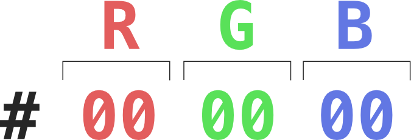
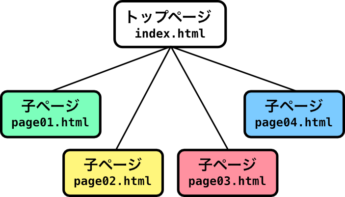
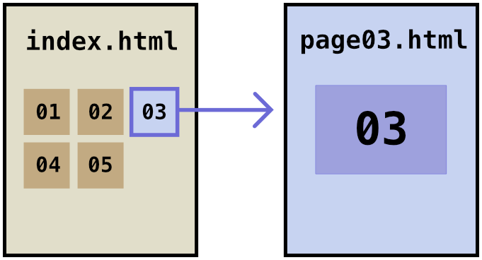
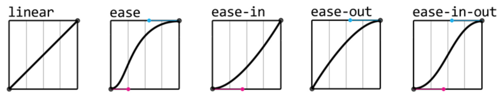

<!-- _class: cover -->

<h1 class="logo"><b>CODE</b>_THE_WEB #6</h1>
<p class="title">コードでウェブをつくろう #6</p>
<p class="author">&copy; 2025 Satoshi Soma</p>

---

## 前回のおさらい 1/4

### スタイルシートを別ファイルに
スタイルシートを *CSS ファイル*に記述し、
**HTML ファイルから読み込ませる**ことができる。

CSS ファイルは、文字化けを防ぐために最初に*文字コード*を設定する。

```css
@charset "utf-8";
```

文字コードは基本的に `utf-8` を指定しておけば問題ない。

---

CSS ファイルを HTML ファイルから読み込ませるには、
**`<link>` タグを `<head>` タグの中**に記述する。

```html
<head>
  <link rel="stylesheet" href="CSSファイルへのパス">
</head>
```

CSS ファイルへのパスは `フォルダ名/ファイル名.css` というルールで指定する。
CSS ファイルが HTML ファイルと**同じフォルダ内**にある場合は `ファイル名.css` だけで良い。

---

## 前回のおさらい 2/4

### VS Code ショートカットキー
<kbd>control</kbd> + <kbd>tab</kbd> で*直前に表示していたタブに戻れる*。
**HTML ファイルと CSS ファイルを行ったり来たり**する際に有用。

<kbd>⌘</kbd> + <kbd>alt</kbd> + <kbd>←</kbd> で*一つ左のタブ*に、
<kbd>⌘</kbd> + <kbd>alt</kbd> + <kbd>→</kbd> で*一つ右のタブ*に移動できる。

ショートカットキーを活用することで**キーボードから手を離す頻度が減るため**、
**集中力を切らさず、コーディングに没頭**することができる。

---

## 前回のおさらい 3/4

### 16 進数値

16 進数は数値の表現方法の一つで、
**一桁をアルファベットを含めた 16 個の数字**で表す。

<table class="numtable">
  <tr>
    <th>10 進数</th>
    <td>0</td>
    <td>1</td>
    <td>2</td>
    <td>3</td>
    <td>4</td>
    <td>5</td>
    <td>6</td>
    <td>7</td>
    <td>8</td>
    <td>9</td>
    <td colspan="6"></td>
  </tr>
  <tr>
    <th>16 進数</th>
    <td>0</td>
    <td>1</td>
    <td>2</td>
    <td>3</td>
    <td>4</td>
    <td>5</td>
    <td>6</td>
    <td>7</td>
    <td>8</td>
    <td>9</td>
    <td>a</td>
    <td>b</td>
    <td>c</td>
    <td>d</td>
    <td>e</td>
    <td>f</td>
  </tr>
</table>

<small>（アルファベットに大文字と小文字の区別は無い。）</small>

---

`16` になるとようやく桁が上がり、*`10`* と表現される。

<table class="numtable">
  <tr>
    <th>10 進数</th>
    <td>15</td>
    <td>16</td>
    <td>17</td>
    <td>18</td>
    <td>…</td>
    <td>29</td>
    <td>30</td>
    <td>31</td>
    <td>32</td>
    <td>…</td>
    <td>160</td>
    <td>161</td>
    <td>162</td>
    <td>…</td>
    <td><b>255</b></td>
  </tr>
  <tr>
    <th>16 進数</th>
    <td>f</td>
    <td>10</td>
    <td>11</td>
    <td>12</td>
    <td>…</td>
    <td>1d</td>
    <td>1e</td>
    <td>1f</td>
    <td>20</td>
    <td>…</td>
    <td>a0</td>
    <td>a1</td>
    <td>a2</td>
    <td>…</td>
    <td><b>ff</b></td>
  </tr>
</table>

`255` が 16 進数では **`ff`** となる。
これは 16 進数において **2 桁で表現できる最大の数**である。


---

<!-- _class: right -->

### 16 進数カラーコード
`#` に続く *6 桁の 16 進数値*で表す。

```css
color: #000000;
```

6 桁の数字は、

- *1, 2 桁目*が <b class="red">R（赤）</b>
- *3, 4 桁目*が <b class="green">G（緑）</b>
- *5, 6 桁目*が <b class="blue">B（青）</b>

を表す 16 進数値。



---

6 桁以外の記述法も存在し、桁数によって意味が変わる。

| 桁数 | 記述例 | 意味 |
|----:|:------|:-----|
| 6 桁 | `#112233`   | <b class="red">R:11</b> <b class="green">G:22</b> <b class="blue">B:33</b> |
| 8 桁 | `#11223344` | <b class="red">R:11</b> <b class="green">G:22</b> <b class="blue">B:33</b> <b>A:44</b> |
| 3 桁 | `#123`（短縮記法） | <b class="red">R:11</b> <b class="green">G:22</b> <b class="blue">B:33</b> |
| 4 桁 | `#1234`（短縮記法） | <b class="red">R:11</b> <b class="green">G:22</b> <b class="blue">B:33</b> <b>A:44</b> |

<small>（<b>A</b> = アルファ値）</small>

---

## 前回のおさらい 4/4

### 自分で調べる力を身につける
他人が書いたコードをコピペしてもいいが、
その**コードの意味**を理解せずにコピペしてはいけない。

知らないプロパティやタグは、**一つ一つ自分で調べよう。**

---

### 真似から入る
良いと思った他サイトのデザインやコードは**マネしてもいい**。
  - 開発者ツール <kbd>⌘</kbd> + <kbd>alt</kbd> + <kbd>I</kbd> を有効に活用しよう。
  - ただし、**単に盗むだけでは自分のものにはならない**。
  **構造や値を変えるなどのアレンジ**を加えてみよう。
  そうすることでコードに対する理解が深まり、**自分のコードになっていく**。

---

### 検索の鬼になる
どんな些細な疑問, 関心事も**ググる**。
  - `css + やりたいこと` で検索すれば**大抵の答えは出る。**
    重要なのは、**正しい情報を自分の目で見極める**ということ
  - あなたがやりたいこと、やろうとしていることは**多くの人が既に通った道。**
    だから必ず答えはある
  - 「*検索力*」も技術のうち

---

# 複数のページを作る

---

世の中には 1 ページのみで完結しているウェブサイトも珍しくはないが、
やはり一般的なのは複数のウェブページで構成されている形式だ。

---

<!-- _class: right -->

基本的には **1 ページにつき一つの HTML ファイル**が必要になる。

それらを*互いにリンクで繋げれば*、一揃いのウェブサイトとなる。

リンクを繋げるにはこれまで通り **`<a>` タグ**を用いれば良い。



---

### サブページの作成
ここまで制作を進めてきた `index.html` をサイトの*トップページ*と位置づけ、
そこからリンクされる*サブページ*（子ページ）を作成していこう。

各ページの制作は、**トップページのコードや素材をできる限り再利用**しつつ進めていく。
これは作業の効率化のためでもあるが、サイト全体を通して**統一化**できる部分は統一化した方が、ある程度**デザインの一貫性**が担保できるという理由もある。

---

ここからは実践的な解説を行うため、
「**自分の撮った写真を載せるポートフォリオサイト**」
という想定で進めていく。

ただ、基本的な考え方や方法論はあらゆる形態のウェブサイトに適用できるものなので、
各自、自分の制作中のサイトに置き換えてほしい。

---

まずはサイトの全体的な構造から考えてみよう。

サイトのメインコンテンツは写真である。各写真のサイズが大体幅 800px 程度として、
仮にトップページに**全ての写真**を載せるとなると、

- ページの*読み込み時間*が長くなる
- スクロールが長くなり*見辛い*

少なくともこのような問題が発生する。

---

特に、サイトの*トップページ*において**読み込み時間の速さ**は極めて重要である。
一秒でも長ければ、読み込みを待たずにブラウザの「*戻る*」ボタンを押されてしまう確率が高くなるからだ。

<small>参考: [Webページの読み込み時間、3秒が限界か - 5秒になると直帰率激増](https://news.mynavi.jp/techplus/article/20180122-573640/)</small>

---

そこで、トップページにはフルサイズの写真は載せず、
代わりに**サムネイル**（一部のみを切り取った縮小画像）を並べていくことにする。

サムネイルには `<a>` タグを付け、
クリックすると**フルサイズの写真が表示される子ページ**に飛ぶように設定する。

サムネイル画像のサイズを、大きくても**幅 300 px 程度**に抑えれば、
読み込み時間とスクロールの問題を*同時に解決*できるだろう。

---

早速サブページを作ってみよう。
ここからは `WORKSPACE` フォルダを基準に解説していく。

1. まず `index.html` を複製する。
2. 複製したファイルの名前を変更する。
  ファイル名はひとまず `page01.html` としておくが、
  *拡張子が `.html` かつ半角英数*であれば基本的に好きな名前で構わない。
3. 複製したファイルをエディタで開く。

---

サブページの HTML ファイルをエディタで開いたら、
**メインパートの内容を全て削除**してしまおう。

メインパートとはつまり `<div class="main">` にあたるが、
内容とは厳密にはその中の **`<div class="wrap">` の中身**にあたる。

```html
<div class="main">
  <div class="wrap">

    （この中を全て削除）

  </div>
</div>
```

---

逆に、*ヘッダーパート*と*フッターパート*は基本的に**全ページ共通の内容とデザインで統一**したいので、一切手を加えなくてもいい。

スタイルシートについては **`style.css` を全ページで共有**するので、
サブページ用に複製する必要はない。

---

次に、このサブページのメインパート内に表示したい写真を一枚設置しよう。

```html
<div class="main">
  <div class="wrap">
    
  </div>
</div>
```

フルサイズの写真とは言ったものの、必要以上に大きいと無駄な読み込み時間が発生する上、通信帯域を圧迫することにも繋がる。

基本的には**ページの最大表示幅**を基準に、適切なサイズに圧縮した画像を使おう。
また、画像のフォーマットは写真なら `JPEG` 、イラストなら `PNG` をお勧めする。

---

写真の表示サイズを**ページの幅にぴったりと合わせる**ためには CSS の調整が必要だ。
そのための下準備として、**写真の `` タグを `<div>` で囲み、クラス名を与える**。

```html
<div class="main">
  <div class="wrap">

    <div class="photo">
      
    </div>

  </div>
</div>
```

クラス名はわかりやすく簡潔に、`photo` としておく。

---

`style.css` をエディタで開き、写真の表示スタイルを調整しよう。

```css
/* photo クラス内の img タグ */
.photo img {
  display: block; /* ブロック要素に変更 */
  width: 100%;    /* 表示幅を親に合わせる */
}
```

`` タグは本来はインライン要素だが、
**`display: block;` でブロック要素に変える**ことができる。

`width` に表示幅を指定するプロパティだが、
`%` 値を与えると**親要素の幅**を基準とした相対指定となる。

---

写真のタイトルや説明、撮影日時といった補足情報を入れておくのも良いだろう。

```html
<div class="main">
  <div class="wrap">
    <h1>写真のタイトル</h1>
    <p>写真の説明</p>
    <div class="photo">
      
    </div>
    <p class="date">Jan 1, 2014</p>
  </div>
</div>
```

後でスタイリングするために、適当にクラス名も与えておこう。

---

次は `index.html` にサブページに設置した写真の*サムネイル画像*を設置しよう。
サムネイルはただの画像ではなく、*サブページへのリンク*となるので、
**`<a>` タグの中に `` タグ**を入れればいい。

```html
<div class="main">
  <div class="wrap">

    <a class="thumbnail" href="page01.html">
      
    </a>

  </div>
</div>
```

リンク先にはサブページの HTML ファイルへのパスを指定する。
クラス名は `thumbnail` としておこう。

---

あとは載せたい写真の分だけ同じ工程を繰り返せばいい。

ただし、トップページに設置するサムネイル画像については、
数が増えるだけ*レイアウトにもそれなりの工夫*が必要になってくるだろう。

そこに対して、当講義で「正解」を掲示することはできないが、
よく使われる形式として、「**グリッドレイアウト**」を紹介する。

---

グリッドレイアウトは「*グリッド*」を基準としたレイアウトの手法だ。
「*グリッド*」とは縦と横に走る複数の線が*格子状*に交わるパターンのことを示す。

グリッドレイアウトにおいて、
横方向の並びを「**列（Column）**」と呼び、
縦方向の並びは「**行（Row）**」と呼ぶ。
要素をグリッドに沿って配置していくことで、
**水平・垂直方向に一定の整ったリズムを意識させるような画面構成**が実現できる（と思う）。

---

### CSS でグリッドレイアウト
CSS でグリッドレイアウトを実現するには、
グリッド上に配置したい要素を**包含する親要素**に以下のようなスタイルを適用する。

```css
親要素 {
  display: grid; /* グリッドレイアウトを有効化 */
  gap: 1em;      /* 各要素間の隙間 */
  grid-template-columns: 1fr 1fr 1fr; /* 3列均等 */
}
```

`grid-template-columns` には、**列の幅**を、
**区切りたい列の数だけ**スペース区切りで指定する。

`fr` は比率を表す単位で、この例だと **1:1:1** の比率という意味になる。

---

以上を踏まえ、簡単なグリッドレイアウトを取り入れたサンプルサイトを作ったので
参考にしてほしい。
[example/index.html](example/index.html)

<hr>

もっと複雑なパターンのグリッドレイアウトを構成することも可能だが、
コーディング難度が高くなりすぎてしまうので、当講義ではこれ以上の深入りはしない。

興味があるなら以下を参考に挑戦してみてほしい。
https://www.webcreatorbox.com/tech/css-grid-layout

---

## CSS でデザインに動きや変化をつける

---

### 擬似クラス (pseudo class)
**ある特定の条件下**にある要素（タグやクラス）のみに**限定してスタイルを当てる**際に使う。

書き方:
```css
要素:擬似クラス名 {
    当てたいスタイル
}
```

---

### `:hover`
任意の要素に **マウスカーソルを乗せた（ホバーした）** 時のみに限定する擬似クラス。

```css
/* <a>タグにホバー時のみ背景色が青に */
a:hover {
    background-color: #3366ff;
    color: white;
}
```

---

### `:active`
任意の要素を **クリックした** 時のみに限定する擬似クラス。

```css
/* buttonクラスをクリックすると */
/* 下に2pxずれる            */
.button:active {
    top: 2px;
}
```

エディタとブラウザで [06_hover-and-active.html](../06_hover-and-active.html) を開いて
実際に動くコードを確認してみよう。

---

### 変化にアニメーションをつける
擬似クラスを利用することで、**状態の変化**を表現できるようになった。
ただし、その変化は *A* という状態から *B* という状態への**瞬時の切り替わり**に過ぎず、
表現としての幅が狭い。

    A → B

そこで *A* から *B* への遷移に **補完フレーム** を挿入し、
**時間を掛けて滑らかに変化**させるアニメーション表現を導入してみたいと思う。

    A → (補完フレーム) → B

---

<style scoped>
figure .shape {
  display: block;
  width: 8em;
  height: 8em;
  margin-left: auto;
  margin-right: auto;
  background-color: turquoise;
  border-radius: 1em;
  transition: all 2s ease-out;
  transform: rotate(20deg);
}
figure .shape:hover {
  background-color: crimson;
  border-radius: 4em;
  transform: rotate(359deg);
  transition: all 1s ease-out;
}
</style>

### `transition`

<div class="cols c21">

<div>

*`transition` プロパティ* を利用することで、
**特定のプロパティの値の変化を滑らかに推移させる**
ことができる。
<small>（*Transition* とは「*遷移*」や「*移り変わり*」という意味。）</small>

</div>
<figure>
  <a class="shape"></a>
</figure>

</div>

---

#### `transition` の書き方:
```css
セレクタ {
  transition: プロパティ名 変化時間;
}
```

`プロパティ名` には `color` や `top`, `width` といった、
**値の変化を補完**させたいプロパティ名を入れる。

`変化時間` は、**何秒かけてアニメーションさせたいか**を入力する。
単位は **`s`** で、*Seconds（秒）* を表す。

```css
セレクタ {
    transition: color 1s; /* color を 1秒 かけて変化させる */
}
```

[07_transition.html](../07_transition.html) をブラウザとエディタで開いて、
実際の動作とコードを確認しよう。

---

#### `transition` を複数のプロパティに適用する
`transition` で **複数のプロパティ** をアニメーションさせたい場合、
二つの方法がある。

一つは `プロパティ名` として **`all`** を指定すること。
これによって **全てのプロパティ** に一括で `transition` を適用することができる。

```css
セレクタ {
    transition: all 1s; /* 全てのプロパティを 1秒 かけて変化させる */
}
```

---

もう一つの方法は **`,（カンマ）`区切りで複数の `transition` 値** を列挙すること。

```css
セレクタ {
    transition: color 1s, width 2s; /* color を 1秒 */
                                    /* width を 2秒 */
}
```

この方法だと、記述は長くなってしまうが、
**プロパティごとに違う変化時間**を設定できるメリットがある。

---

#### `transition` の緩急を変える
次は `transition` の変化速度の**緩急**を変えてみよう。
緩急は `変化時間` の後にスペースを挟んで指定することができる。

```css
セレクタ {
    transition: プロパティ名 変化時間 緩急;
}
```

`緩急` には以下のキーワードの中から適切なものを選択する。
`ease` `ease-in` `ease-out` `ease-in-out` `linear`

---

キーワード毎の動作はだいたい以下のとおり。

| 値 | 動作 |
|:---|:---|
| `linear` | 始まりから終わりまで一定の速さ |
| `ease` | 始まりと終わりが緩やか（デフォルト）
| `ease-in` | 始まりが遅く、だんだん速くなる |
| `ease-out` | 始まりが早く、だんだん遅くなる |
| `ease-in-out` | `ease`をより強調 |

---

キーワード毎の速度の変化をグラフに表すと以下のとおり。



---

## 演習:
動きのあるボタンを作ってみよう
- デザイン等は自由
- 複数作ってもいい
- `:hover`, `:active` 擬似クラスを使うこと
- `transition` プロパティを使ってアニメーション効果を入れること
