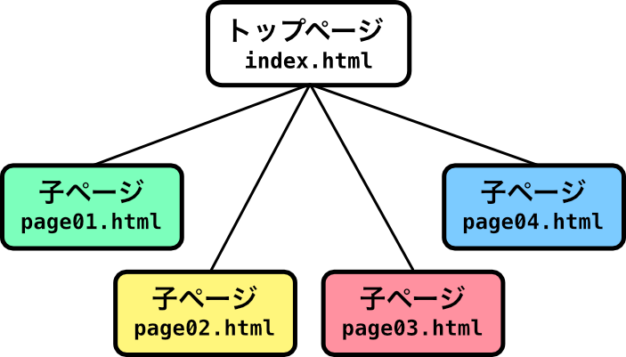
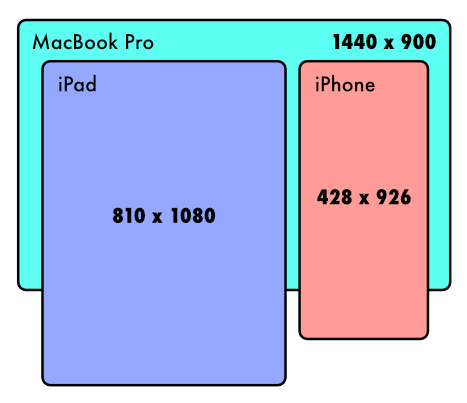

<!-- _class: cover -->

<h1 class="logo"><b>CODE</b>_THE_WEB #7</h1>
<p class="title">コードでウェブをつくろう #7</p>
<p class="author">&copy; 2024 Satoshi Soma</p>

---

## 前回のおさらい 1/2

### 複数のページで構成されるウェブサイト
ウェブサイトは**複数のページ**から構成された形態が一般的である。
基本的には **1 ページにつき一つの HTML ファイル**を用意し、それらをリンクで繋げればよい。
その際、**トップページは `index.html`** というファイル名にするのが暗黙的なきまりである。

---

### ページを複数にわけるメリット
- コンテンツ量が分散され、**ページの読み込み時間（= ユーザーの待ち時間）が減る**
- ページのスクロールが長くなり過ぎず、見やすい
- 適切なリンクさえ設置しておけば、
ユーザーが各々の目的のコンテンツに素早くたどり着ける

---

## 前回のおさらい 2/2

### グリッドレイアウト
グリッドレイアウトは「*グリッド*」を基準としたレイアウトの手法だ。

「*グリッド*」とは縦と横に走る複数の線が*格子状*に交わるパターンのことを示す。
横方向の並びを「**列（Column）**」と呼び、
縦方向の並びは「**行（Row）**」と呼ぶ。
要素をグリッドに沿って配置していくことで、
**水平・垂直方向に一定の整ったリズムを意識させるような画面構成**が実現できる（と思う）。

---

CSS でグリッドレイアウトを実現するには、
グリッド上に配置したい要素を**包含する親要素**に以下のようなスタイルを適用する。

```css
親要素 {
  display: grid; /* グリッドレイアウトを有効化 */
  gap: 1em;      /* 各要素間の隙間 */
  grid-template-columns: 1fr 1fr 1fr; /* 3列均等 */
}
```

`grid-template-columns` には、**列の幅**を、
**区切りたい列の数だけ**スペース区切りで指定する。

`fr` は比率を表す単位で、この例だと **1:1:1** の比率という意味になる。

用例: [06/example/index.html](../06/example/index.html)

---

## レスポンシブデザイン
様々なデバイスに対応するデザイン

---

<div class="cols c12" style="align-items:center">

<figure>



</figure>

モバイル機器、とりわけ*スマートフォン*でウェブサイトを閲覧する場合、*表示できる領域*がデスクトップ環境のそれと比べて**著しく制限**されることになる。

</div>

---

参考サイト:
- [docolatte](https://amekusa.github.io/docolatte/index.html)
- [nintendo.com](https://www.nintendo.com/jp/)


あなたのサイト、*スマホではどう見える*？
ブラウザでシミュレートしてみよう。

1. 制作中のサイトを Chrome で開く
2. 開発者ツール <kbd>⌘</kbd> + <kbd>alt</kbd> + <kbd>I</kbd> を開く
3.  アイコンをクリック
4. シミュレートしたいデバイスをリストから選ぶ
リストに無い場合は画面サイズの値を直接入力

<hr>

スマホ画面サイズ参考:
https://viewportsizer.com/devices/

---

### ビューポート
現状の HTML を iPhone SE（横幅 375px）などでシミュレートしてみると、
まず全体的にテキストが小さく、読みづらい印象を受けるのではないだろうか？

スマホ用のブラウザは内部に「**ビューポート（Viewport）**」という仮想的な表示領域（ウィンドウ）を持っており、この領域内からページの横幅がはみ出さないよう、
できる限り*拡大/縮小*して表示している。

---

問題はこのビューポートのデフォルトサイズが、多くの場合、
**実際の画面サイズ (px) よりも大きく設定されている**点だ。

ちなみに Chrome のシミュレータだと、デフォルトのビューポート幅は 980px となる。

つまり、先ほどのシミュレーションでは、
内部的には幅 980px の仮想的なウィンドウ内にページをレンダリング（描画）し、
それを*デバイスの画面サイズ（iPhone SE なら 375px）に収まるよう**縮小**した結果*が
画面に反映されていた、ということになる。

テキストが小さく表示されていたのはそのためである。

---

ビューポートのサイズ決定権をブラウザに一任することには問題がある。
だが、これには解決方法がある。
実はビューポートのサイズは HTML で指定することができるのだ。

単刀直入に、以下の `<meta>` タグを **`<head>` タグ内**に書き加えれば良い。

```html
<meta name="viewport" content="width=device-width, initial-scale=1">
```

---

```html
<meta name="viewport" content="width=device-width, initial-scale=1">
```

このタグの解説を簡単にすると、
- `width=device-width` はビューポートに対して、
「**幅をデバイスの画面幅と一致させよ**」という指定
- `initial-scale=1` はビューポートに対して、
「**拡大も縮小もするな**」という指定となる。

`initial-scale` はあくまで初期設定値であり、*ユーザーのピンチイン/アウト操作による任意の拡大/縮小操作を禁止するものではない*ことには留意されたし。

---

`<meta>` タグを `<head>` タグ内に書き加えたら、
Chrome のデバイスシミュレータ上で表示がどのように変化したか確認してみよう。

---

### メディアクエリ
`<meta>` タグを書き加えたことでビューポートとフォントサイズの問題は解決した。
しかし、手のひらに収まるほど小さい縦長のスマホの画面上と、横長のモニター上とでは
**サイトの見え方に根本的な違いが表れてしまう**のは避けられない。

この違いを少しでも吸収し、**各デバイスに対して最適**なデザインをサイトに適用することは可能だろうか？ 答えは「**メディアクエリ（Media Queries）**」にある。

---

メディアクエリは **CSS の構文**の一種で、
**適用するスタイルをビューポートサイズによって変える**ことができる。

メディアクエリは `@media 条件 {` から始まり、`}` で終わる。

```css
@media 条件 {
  /* 適用する CSS を記述する */
}
```

`{ }` 内には通常通り CSS を記述する。
`条件` は後述するが、**`{ }` に記述した CSS を有効にする条件**を指定する。

---

```css
@media (max-width: 640px) {
  h1 {
    font-size: 21px;
  }
}
```
例えばこのメディアクエリは
- ビューポート **640px 以下**の場合のみ
- `<h1>` に `font-size: 21px` を適用する

という意味になり、
`(max-width: 640px)` の部分が「*条件*」にあたる。

---

`(max-width: 640px)` ではなく、
`(min-width: 640px)` とすれば、640px **以上**の場合を条件とすることもできる。

他にも様々な条件の指定方法が存在するが、一般的なブラウザ環境への対応は
`max-width` と `min-width` があれば事足りるだろう。

<hr>

参考: https://developer.mozilla.org/ja/docs/Web/CSS/Media_Queries/Using_media_queries

---

## メタ情報
一般的に、**メタ情報** あるいは **メタデータ** とは、
ある主体にとっての**自己言及的**な情報を指す。

代表的なメタ情報の例として、デジタル写真の **Exif データ** が挙げられる。
Exif データに記録されている、
- 撮影日時
- 位置情報（ジオタグ）
- 撮影機器名

といった情報は、**写真データに付帯するメタ情報**と言える。

---

デジタル写真と同様、**ウェブページ**にもメタ情報を持たせることができ、
**ページのコンテンツに対して適切な付帯情報**を与えることで、
- Google などの検索エンジンに対する最適化（SEO）
- **訪問者の閲覧環境の差異**の吸収
    - 言語
    - デバイス
    - ブラウザなど

といった効果が得られる。

---

### HTML メタ情報の入力
ウェブページに与えるメタ情報は HTML の **`<head>` タグの中** に記述する。
そしてメタ情報一つにつき、**`<meta>` タグ** を一つ用いて記述する。

ちなみに `<meta>` タグに**閉じタグは存在しない。**（このようなタグを **空要素** という）

#### `<meta>` タグの書き方:

```html
<!DOCTYPE html>
<html>
    <head>
        <meta name="メタ情報名" content="情報の内容">
        …
    </head>
    …
</html>
```

[08_meta.html](08_meta.html) をエディタで開いて確認してみよう。

---

#### 文字コードの指定

```html
<meta charset="utf-8">
```

この記述は、その HTML ファイル全体で使用されている **文字コード（エンコード）**
を示している。エディタとして VSCode や Atom を使用しているのなら
**`utf-8`** で基本的に問題ない。

この記述が無かったり正しくないと、ブラウザでページを表示した際に**日本語等が文字化け**してしまう場合があるので注意すること。

また、この記述は極力 **`<head>` タグの直後** に書くことが望ましいとされている。

---

#### 概要

```html
<meta name="description" content="これはサンプルコードです">
```

**`description`** は **そのページの概要** を表す一文で、
`content` 属性の中に自由に、ただし簡潔に記述すること。

この情報は **検索対象** として扱われたり、
検索結果一覧の **概要欄** に表示されたりする場合がある。

---

#### キーワード

```html
<meta name="keywords" content="初心者, HTML, チュートリアル">
```

**`keywords`** はそのページの **検索対象となるキーワード** を設定する情報で、
`content` 属性の中に **`,`（カンマ）区切り** で複数個を指定することができる。

**キーワードの選定**は、
- ページやサイト全体のテーマと関わりの深い言葉
- ターゲットの客層が検索しそうなワード

あたりを基準とするのが良いと思われる。

また、**キーワードの数**に制限は無いが、
**多くても 10 個以内** にとどめるのが一般的であると考えられる。

---

#### 作者, 著者

```html
<meta name="author" content="Satoshi Soma">
```

**`author`** はそのページの **作者や著者** を記した情報で、
`content` 属性の中に **自由記述** で書き表す。

このメタ情報に関しては特に記述のルールが指定されていない。
また、検索エンジンや SNS などにおいてどのように扱われるかも定かではない。

著作権の所在を明確にする意図があれば記述しておくと良いだろう。

---

### その他の付帯情報

#### ページタイトル

```html
<title>タイトル</title>
```

**`<title>` タグ** はページのタイトルを設定するタグである。
サイト上には表示されないが、
- 検索結果
- ブラウザのタブ上
- ブックマークや閲覧履歴
- SNS でシェアされた際のリンクテキスト

などに使用される。

---

#### アイコン（favicon）

```html
<link rel="icon" href="画像ファイルのパス">
```

**`<link>` タグ** を用いて、任意の画像を **ページのアイコン** として設定することができる。
この画像も**ページタイトルとセット**で参照されることが多い。

**正方形** の画像であることが望ましく、
サイズは **16x16 ピクセル** や **32x32 ピクセル** が一般的である。

---

#### 言語

```html
<html lang="言語コード">
```

**`<html>` タグの `lang` 属性** で、
そのページで使用されている **言語（英語や日本語など）** を明示する。

言語コードは **ISO（国際標準化機構）** によって定められているものを使用する。

| 言語 | 言語コード | | 言語 | 言語コード |
|---:|:---|---|---:|:---|
| 日本語      | `ja` | | 中国語    | `zh` |
| 英語        | `en` | | 韓国語   | `ko` |
| ポルトガル語 | `pt` | | フランス語 | `fr` |

---

#### CSS ファイルの文字コード
スタイルシートの記述に **CSS ファイル** を使用している場合は、
そこで使われている文字コードも明示しておくことが望ましい。

```css
@charset "utf-8";
```
この記述を **CSS ファイルの 1 行目** に追加する。

これも HTML と同様、
エディタとして VSCode や Atom を使用しているのなら
**`utf-8`** で基本的に問題ない。

[example/style.css](example/style.css) を参照のこと。
