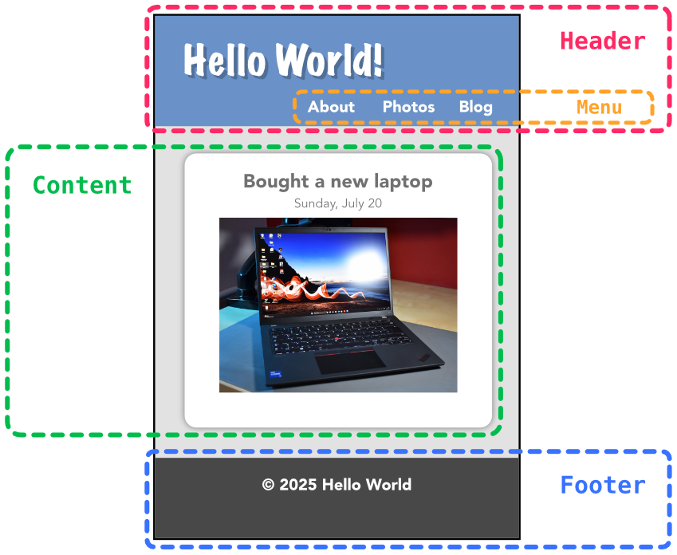

<!-- _class: cover -->

<h1 class="logo"><b>CODE</b>_THE_WEB #8</h1>
<p class="title">コードでウェブをつくろう #8</p>
<p class="author">&copy; 2025 Satoshi Soma</p>

---

# サイト更新の効率化

---

## 「公開して終わり」では勿体無い
サイトを公開するだけで満足してはいけない。
更新されないウェブサイトはやがて検索一覧の中に埋もれてしまう。

---

## 現状の問題点
- *コンテント（ページ）の追加 ＝ HTML ファイルの追加*
  - 既存の HTML ファイルをコピーしなければならないため*面倒*である。
  - ヘッダー, フッターなど、*サイト全体を通して共通の箇所*に変更を加えたくなった場合、
  コピーして追加した**全て**の HTML ファイルに変更を加えなければならない。

<hr>

一般的な*ブログシステム*のように、記事の*タイトルと本文*（＝コンテント）を投稿するだけで
**自動でページが生成されるような仕組み**が欲しい。

---

## 制作環境の整理
ここからは作業全体が複雑化し、使用するファイルの数が一気に増える。
混乱を避けるため、ここで改めて制作環境の整理をしよう。

<hr>

これまで作業場として使用してきた `WORKSPACE` フォルダは今後、
「**プロジェクト・ルート (Project Root)**」と呼称する。

そして、フォルダ名を `WORKSPACE` ではなく**自分のサイト名を表す文字列**<small>（半角英数）</small>に変更し、
デスクトップやドキュメントフォルダなどの*アクセスしやすい場所に移動*してほしい。

加えて、**サイトに必要の無いファイルは全て削除**すること。

---

## Hugo のインストール

### Hugo の実行ファイルをダウンロード
以下のページより最新のバージョンの実行ファイルを DL する。
https://github.com/gohugoio/hugo/releases

ファイル名に *`darwin`* が含まれるものが macOS 用だ。

<hr>

DL したファイルを展開すると *`hugo`* というファイルが出てくる。これが実行ファイルだ。

---

### 実行ファイルを移動
`hugo` を自分のプロジェクトルート直下に移動させよう。

```
📁 プロジェクトルート/
├── index.html
├── style.css
├── ...
└── hugo
```

---

## ターミナルの使い方
Hugo はダブルクリックで実行する一般的なアプリとは異なり、
**CLI アプリケーション**と呼ばれるものに属する。
CLI とは *Command Line Interface（コマンドライン・インターフェース）* の略だ。

<hr>

それに対し、ダブルクリックで専用のウィンドウが開くような一般的な形式のソフトウェアは
**GUI (Graphical User Interface) アプリケーション**と呼び区別される。

---

基本的に CLI アプリは*ターミナル上で使用*されることを前提に設計されている。
早速ターミナルを開いてみよう。

```sh
%
```

表示されている `%` 記号の後に続けて「*コマンド*」と呼ばれる文字列を入力する。
`Enter` キーをタイプするとコマンドを実行することができる。

<hr>

試しに `ls` というコマンドを実行してみよう。

```sh
% ls
```

すると `Pictures` や `Documents` といったフォルダの一覧が表示されるはずだ。

---

### 代表的なコマンド

| コマンド名 | 説明 | 用例 |
| :-- | :-- | :-- |
| `echo` | 文字列を出力する | `echo "Hello!"`
| `pwd`  | 現在の作業ディレクトリを表示する | `pwd`
| `ls`   | ファイル & フォルダの一覧を表示する | `ls`
| `cd`   | ディレクトリを移動する | `cd Desktop/Downloads`
| `cat`  | ファイルの内容を出力する | `cat file.txt`
| `cp`   | ファイルをコピーする | `cp alfa.txt bravo.txt`
| `mv`   | ファイルを移動する | `mv file.txt Desktop/`
| `rm`   | ファイルを削除する | `rm file.txt`

---

ターミナルには**作業ディレクトリ (Working Directory)** という概念が存在する。
ディレクトリは「*📁 フォルダ*」と読み替えても差し支えない。
要するに、**自分が現在どのフォルダに居るのか**を示すものだ。

<hr>

現在の作業ディレクトリは `pwd` コマンドで確認できる。
作業ディレクトリを変更する、つまりフォルダを移動するには `cd` コマンドを使う。

```sh
% cd 移動先ディレクトリ名
```

ターミナルを使用する際は必ず以下の事を心掛けよう。 
- 最初に `cd` コマンドで**作業場となるフォルダまで移動**する。
- 他のコマンドを実行する前に、自分が**正しい作業ディレクトリ**にいるかを確認する。

---

### Mac の大まかなディレクトリ構成

```sh
📁 /              # ルート
├── 📁 System/        # OS のシステムファイル群
├── 📁 Applications/  # アプリケーション群
│   ├── Safari.app
│   ├── Mail.app
│   └── ...
└── 📁 Users/         # 各ユーザーのホームディレクトリ群
    ├── 👤 alice/         # alice のホームディレクトリ
    ├── 👤 bob/           # bob のホームディレクトリ
    └── 👤 charlie/       # charlie のホームディレクトリ
        ├── 📁 Desktop/       # charlie のデスクトップ
        ├── 📁 Downloads/     # charlie のダウンロードファイル群
        └── ...
```

普段デスクトップに表示されているファイルやフォルダは全て、
実際は *`/Users/自分のユーザー名/Desktop`* というディレクトリ下に存在している。

---

早速 `cd` コマンドでプロジェクトルートまで移動しよう。
デスクトップに置いてある場合はまず、

```sh
% cd
```

このように*移動先を指定せず*に `cd` コマンドを実行する。
すると自分の**ホームディレクトリ**、すなわち `/Users/自分のユーザー名` に移動することができる。
そのあとは単に、

```sh
% cd Desktop
```

とだけ実行すれば `/Users/自分のユーザー名/Desktop` に移動することができる。

---

ちなみに、ディレクトリ名やファイル名はいちいち全て手入力しなくても、
**途中まで入力してから `Tab` キー**を押せば自動で補完される。

<hr>

もし移動先のディレクトリを間違ってしまったら、

```sh
% cd ..
```

で**一つ上の階層**のディレクトリに戻ることができる。

<hr>

また、**`↑`** キーをタイプすると、**過去に実行したコマンドの履歴を遡る**ことができる。覚えておこう。

---

`ls` コマンドでフォルダの一覧を表示し、プロジェクトルートの存在を確認したら、

```sh
% cd プロジェクトルートの名前
```

でプロジェクトルートに移動する。移動先は *`Tab` キーで補完*できることを忘れずに。

次に `ls` コマンドでファイルの一覧を表示し、
その中に先ほどダウンロードして移動させた *`hugo`* ファイルが存在することを確認する。

---

#### ここまでのまとめ :: ターミナルの操作
| コマンド or 入力キー | 説明 |
| :-- | :-- |
| `cd` | 自分のホームディレクトリに移動
| `cd 移動先ディレクトリ名` | 任意のディレクトリに移動
| `cd ..` | 一つ上の階層のディレクトリに移動
| `pwd` | 現在地（作業ディレクトリ）の確認
| `ls` | 作業ディレクトリ内のファイル & フォルダ一覧を表示
| `Tab` キー | ファイル名の自動補完
| `↑` キー | コマンドの実行履歴を遡る

---

## Hugo の使い方 
Hugo は以下のようなコマンドで実行可能だ。

```sh
% ./hugo サブコマンド
```

サブコマンドの一覧は

```sh
% ./hugo help
```

で確認することができる。

---

### テーマをインストールする
Hugo における「**テーマ**」とは端的に言うとウェブサイトのコンテント**以外**の部分、
言うなれば “*ガワ*” のことを指す。

<div class="cols gap">



<div>
この作例で言う所の

- Header
- Menu
- Footer

がテーマに属する部分とだいたい言える。
</div>

</div>

---

Hugo のテーマは以下のページから好きなものを選んで使うことができる。
https://themes.gohugo.io/

テーマを実際に使用するためには `プロジェクトルート` 下に *`themes`* というディレクリを作成し、
その中に DL したテーマフォルダを置く必要がある。

```sh
📁 プロジェクトルート/
├── 📁 themes/
│   └── 📁 テーマフォルダ/
├── ...
└── hugo
```

まずは *`mkdir`* コマンドで `themes` フォルダを作成しよう。

```sh
% mkdir themes
```

<small>注意: *作業ディレクトリ*がプロジェクトルートであることを確認してからコマンドを実行すること。</small>

---

今回は *[Ardeidae](https://themes.gohugo.io/themes/ardeidae/)* <small>（発音: アルディーエダエ）</small> というテーマを使うことにする。

1. 「Download」をクリックし、GitHub のページへ。
2. 「Code」をクリック。
3. *HTTPS* の URL ( `https://github.com/LuisSousaRego/Ardeidae.git` ) をコピー。
4. ターミナルで、先ほど作成した `themes` フォルダに移動する。
```sh
% cd themes
```
5. *`git clone`* コマンドでテーマを DL する。
```sh
% git clone コピーしたURL
```

`プロジェクトルート/themes` 直下に `Ardeidae` フォルダができていればテーマのインストールは成功だ。
*`ls`* コマンドで確認してみよう。
 
---

### サイトを起動する
`cd ..` コマンドでプロジェクトルートに戻り、以下のコマンドを実行する。

```sh
% ./hugo server -D -t Ardeidae
```

*`hugo server`* は**サイトを動作させるためのサーバー**を起動するコマンドだ。
後ろの `-t Ardeidae` の部分は「*Ardeidae をテーマとしてサイトを構築せよ*」という指定だ。

<hr>

サーバーの起動に成功したらブラウザで以下の URL にアクセスすることで、
サイトの動作確認を行うことができる。
http://localhost:1313

`:1313` の部分は*ポート番号*を表している。環境によっては異なるポート番号が割り当てられる場合があるので、ターミナルに表示される情報もよく確認しよう。

---

### ページを作成する
現状、サイトにはコンテントが何も存在しない空っぽの状態だ。
起動したサーバーを一旦停止させ、ページをいくつか作成してみよう。
サーバーを停止させるには `Control` + `C` を押す。

まずは `content` というフォルダを作成する。

```sh
% mkdir content
```

新しいページを作成するには *`hugo new content ファイル名`* というコマンドを実行する。
試しに `hello.html` というファイル名でページを作成してみよう。

```sh
% ./hugo new content hello.html
```

そして再びサーバーを起動し、ページが作成されているかを確認する。

```sh
% ./hugo server -D -t Ardeidae 
```

----

作成したページは `content` フォルダ内に保存されている。

`content/hello.html` をエディターで編集してみよう。
編集した内容は即座にブラウザにも反映される。

また、ページを新たに作成するために、必ずしも `hugo new content` コマンドを使用せずともよい。
ただし、直接 `content` フォルダ下に HTML ファイルを作成する場合は、

```
---
title: "ページのタイトル"
---
```

このような書式の**メタ情報**をファイルの先頭に書き込む必要がある。

---

ページに画像などの素材<small>（ブログ記事に添える写真など）</small>を添付したい場合は、

<div class="cols gap">

```sh
# 画像なし: hello.html
📁 プロジェクトルート/
├── 📁 content/
│   ├── hello.html
│   ...
...
```

```sh
# 画像あり: hello/index.html
📁 プロジェクトルート/
├── 📁 content/
│   ├── 📁 hello/
│   │   ├── index.html
│   │   └── image.jpg  # 素材ファイル名は任意
│   ...
...
```

</div>

右に図示したようなファイル構成にすればよい。
配置した画像は `index.html` 内で

```html

```

とすれば表示することができる。

---

## Hugo のテーマを作成する
ここからが本題だ。既に制作済みの自分のサイトを **Hugo のテーマとして実装**しよう。
そのための足がかりとして、簡単な雛形となるファイルをいくつか用意した。

1. `📁 08/hugo_example` を開く
2. 中身を全て選択し、コピー `⌘ + C` 
3. `📁 プロジェクトルート` を開く
4. ペースト `⌘ + V` 
5. 既に存在するフォルダは全て「*統合 (Merge)*」する

---

現時点でプロジェクトルート下がだいたいこのようなファイル構成になっていれば OK だ。

```sh
📁 プロジェクトルート/
├── index.html     # 自サイトトップページ
├── style.css      # 自サイト CSS
├── ...
├── hugo           # Hugo 実行ファイル
├── hugo.toml      # Hugo 設定ファイル
├── 📁 content/        # コンテントフォルダ
│   └── _index.html        # トップページ用のコンテント
└── 📁 themes/         # テーマフォルダ
    ├── 📁 Ardeidae/       # DL したテーマ
    └── 📁 mytheme/        # これから制作するテーマ
```

---

`📁 themes/mytheme` 内にはテーマの雛形となるファイルを入れておいた。
以下のような構成となっている。

```sh
📁 mytheme/          # これから制作するテーマ
├── 📁 layouts/          # HTML テンプレート群
│   ├── 📁 _default/         # ページ毎のテンプレート群
│   │   ├── index.html           # トップページのテンプレート
│   │   └── single.html          # サブページのテンプレート
│   └── 📁 partials/         # テンプレートパーツ群
│       ├── header.html          # ヘッダー部
│       └── footer.html          # フッター部
└── 📁 static/           # 素材ファイル群
    └── style.css            # サイトの CSS
```

各ファイルの内容を自分のサイトの HTML と照らし合わせ、
適切に書き換えてやることでテーマとして完成するという仕組みだ。

---

**テンプレート**とは Hugo がページを組み立てる際に使用する*設計図*のようなもので、
書き方はこれまで学んできた *HTML* と基本的に変わらない。拡張子が `.html` なのも同じだ。

ただし、Hugo テンプレートには HTML には無い*独自の拡張機能*が備わっている。
例として `📁 mytheme/layouts/_default/index.html` をエディタで見てみよう。

<hr>

コードをよく見ると、
`{{ .Site.LanguageCode }}` `{{ .Site.Title }}` `{{ partial "header.html" . }}` 
`{{ partial "footer.html" . }}` `{{ .Content }}` 
といった見慣れない特徴的な記述が目に入るはずだ。

これらの記述はまとめて「**テンプレート構文**」と呼ばれるもので、
Hugo だけが理解できる*特殊な命令文*のようなものだと思ってほしい。

---

テンプレート構文には様々な種類が存在するが、当講義では必要最小限の解説のみに留める。
まず大前提として、全てのテンプレート構文は必ず **`{{` で始まり `}}` で終わる**。

<hr>


```html
<html lang="{{ .Site.LanguageCode }}">
```

```html
<title>{{ .Site.Title }}</title>
```

これらの記述は**サイトの設定ファイル `hugo.toml`** に記述してある情報を参照するもので、
`hugo.toml` が左のような内容だった場合、最終的に完成する HTML では右のように置き換わる。

<div class="cols gap c23">

```toml
# hugo.toml
languageCode = "ja"
title = "My Hugo Site"
```

<div>

```html
<html lang="ja">
```

```html
<title>My Hugo Site</title>
```

</div>
</div>

---

```html
{{ partial "header.html" . }}
```

```html
{{ partial "footer.html" . }}
```

これらの記述は `📁 mytheme/layouts/partials` 下にあるテンプレートを**部品**として読み込み、
その*内容で置き換える*、という構文だ。

<hr>

ウェブサイトの HTML を組んでいると、**サイト全体を通して共通化させたい**という部分が必ず出てくるものだ。*ヘッダー*や*フッター*, *ナビゲーション要素*といった部分が代表的だろう。

それらをそれぞれ**独立した HTML ファイル**として切り出し `📁 partials` に配置しておけば、
`{{ partial "ファイル名" . }}` でどこからでも呼び出して*再利用*できるという仕組みだ。

---

```html
{{ .Content }}
```

この記述は `📁 プロジェクトルート/content` 下の*いずれかの HTML ファイル*を読み込み、
その内容で置き換える構文だ。

どの HTML ファイルが読み込まれるかは**その時のページの URL** によって決まる。

<hr>

`🌐 http://localhost:1313/hello/`
例えばこのような URL なら、読み込まれるコンテントは
`📁 プロジェクトルート/content/hello.html` または
`📁 プロジェクトルート/content/hello/index.html`
となる。

---

### テーマ用素材
- CSS ファイル
- JS ファイル
- フォントファイル
- favicon
- メイン*以外*の部分で使用する画像

これらのファイルは全て「*テーマ用素材*」として扱うものとする。
そして全てのテーマ用素材は `📁 mytheme/static` 内に配置されるべきだ。

<hr>

ひとまず、すでに存在する
`📁 mytheme/static/style.css` は単なる雛形ファイルなので、
`📁 プロジェクトルート/style.css` で置き換えてしまおう。

---

`📁 mytheme/static` に配置したファイルへのパスは**絶対パス**で指定する必要がある。

絶対パスとは**サイトのトップページから見た場合のパス**のことで、
相対パスと区別するために、頭に `/` をつける決まりとなっている。

今回の場合、

```html
<link rel="stylesheet" href="style.css">
```

となっているパスを

```html
<link rel="stylesheet" href="/style.css">
```

このように直すだけで良い。
その他の素材ファイルについても同様に直す必要がある。

---

# サイトの公開

---

Hugo によって構築されたウェブサイトは `📁 プロジェクトルート/public` 内に出力される。


