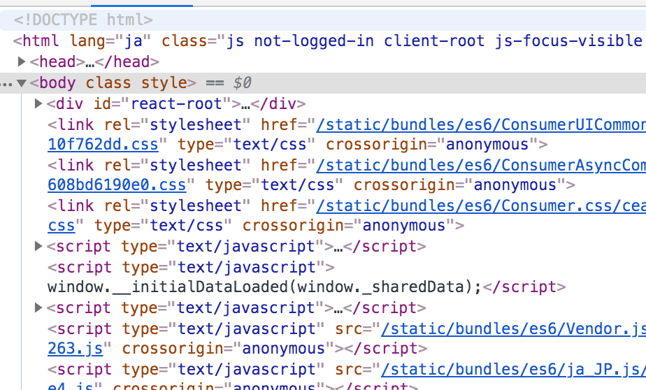

# { CODE_THE_WEB }
コードでウェブをつくろう

---

## ウェブサイトは何でできている？
- [YouTube](https://www.youtube.com/): 動画中心
- [Instagram](https://www.instagram.com/shibasnacks/): 画像中心
- [SoundCloud](https://soundcloud.com/stillwoozy): サウンド中心
- [Wikipedia](https://www.wikipedia.org/): テキスト中心
- [Twitter](https://twitter.com/daftpunk_music): いろいろ

---

## でも…
動画, 画像, サウンド, テキストといった素材は
ウェブサイトを構成する**部品**にすぎない。

部品をただ並べるだけではウェブサイトはつくれない。
それらを**サイトとして組み立てる仕組み**が必要。

---

## ナカミをみてみよう
1. 適当なサイトをブラウザで開く (Wixで作ったサイトでもOK)
2. 開発者ツールを開く `alt + cmd + I`

---

## これは "HTML コード" といいます。

HTML とは

**H**yper :: ハイパー
**T**ext :: テキスト
**M**arkup :: マークアップ
**L**anguage :: 言語

の略です。



---

## "ほぼ" 全てのウェブサイトは HTML コードでできている
Wixでつくったサイトも
[YouTube](https://www.youtube.com)も
[Apple](https://www.apple.com)のサイトも
[Google](https://www.google.com)の検索一覧も
[阿部寛のホームページ](http://abehiroshi.la.coocan.jp/)も

---

## "コード" とは
一定のルール（言語, 文法）に従って書かれた**テキスト（文字情報）**。

ゆえに **HTML コード**とは、
**HTML という言語, 文法**に従って書かれたテキスト（文字情報）。

---

## 書いてみよう HTML
ただのテキストなので高いソフトなどは要りません。
必要なのは**テキストエディタ**だけ。

- TextEdit (macOS)
- メモ帳 (Windows)

---

## でもどうせなら適したエディタを

### [VisualStudio Code (VS Code)](https://code.visualstudio.com/)
- マイクロソフトが開発しているプログラマー向け高機能テキストエディタ
- 新しい（開発が盛ん）
- 流行ってる

### [Atom](https://atom.io/)
- GitHub が開発しているウェブ開発者向けテキストエディタ
- 見た目がかっこいい
- 上級者向けかも

---

## 編集環境の用意

### 1. 講義のプロジェクトフォルダをダウンロード
https://github.com/amekusa/code_the_web

ダウンロードできたら、適当な場所に展開し、
フォルダ名を **`code_the_web`** に変更する。

### 2. VS Code でフォルダを開く

---

## .html ファイルを編集
1. `00_base.html` を `index.html` として**コピー**
2. ブラウザでそのファイルを開く（ドラッグ&ドロップ）
3. エディタでそのファイルを開く
4. `Hello World! こんにちは！` の部分を編集
5. ブラウザを更新
6. 表示の変化を確認する
7. 開発者ツール `alt + cmd + I` でも確認する

---

## HTML の文法
HTML の文法は "**タグ**" で成り立っている。

こういうのがタグ。
- `<html>`
- `<head>`
- `<body>`
- `<h1>`
- `<p>`


タグには役割に応じて様々な種類が存在するが、
どれも必ず `<` と `>` で挟まれている。

`<` と `>` で挟まれている部分はタグの名前。

---

一部の例外もあるが、ほとんどのタグは**それ単体では意味を成さない。**
タグは**テキストを囲むことでそのテキストに意味を与える。**

```html
<h1>こんにちは</h1>
```

これは "こんにちは" というテキストを `<h1>` タグで囲んだ例である。

`</h1>` は "**閉じタグ**" といって、`<h1>` と必ずセットになっている。
（スラッシュが入っていることを見逃してはならない。）

---

`<h1>` タグは "**見出し**" を意味するタグである。
(h は Heading からきている。)
`<h1>` と `</h1>` でテキストをくくることで、
そこに "見出し" という意味を与えることができる。

試しに `index.html` の "こんにちは！" の部分だけを `<h1>` でくくってみよう。
そしてブラウザで表示がどう変化したかを観察してほしい。

---

## 基本的なタグを見てみる
`01_tags.html` を開く。

---

## タグと属性
タグには "**属性**" をつけることができる。

書き方はこのようになる。
```html
<タグ名 属性名="属性値">
```

どんなタグにもつけられる属性もあれば、
特定のタグにしかつけられない属性もある。

`02_attributes.html` を見てみよう。

---

[#2 へつづく](README_2.html)
